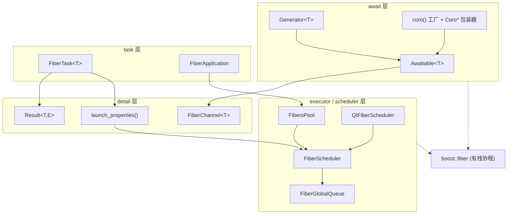
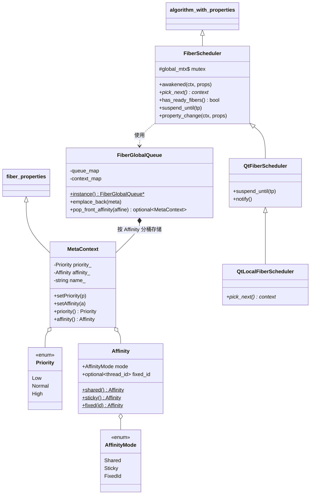
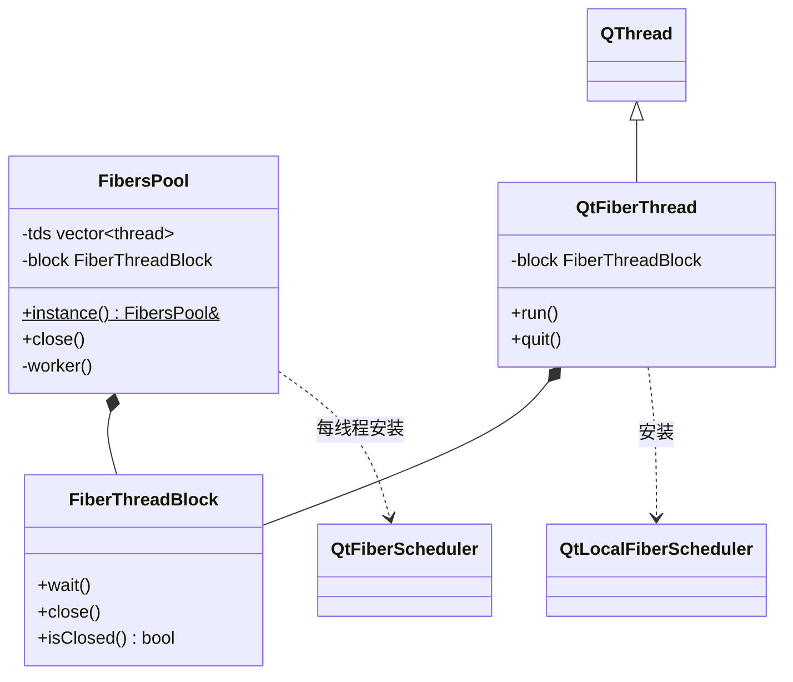
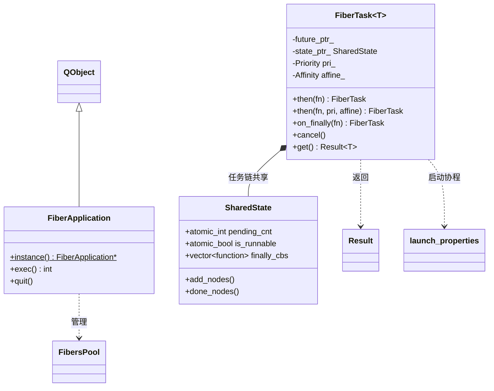
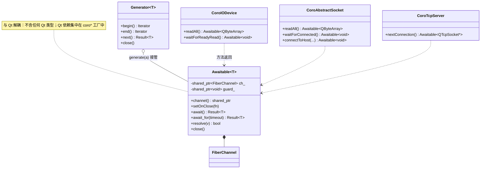
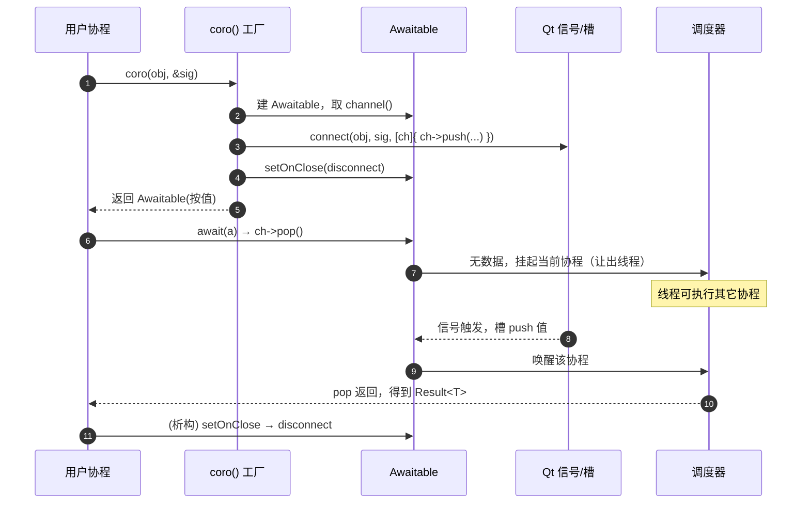
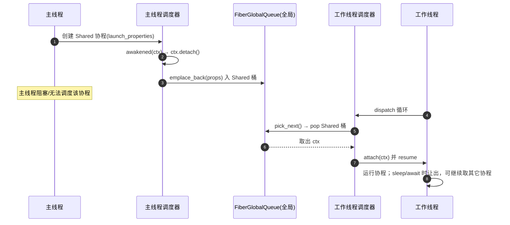
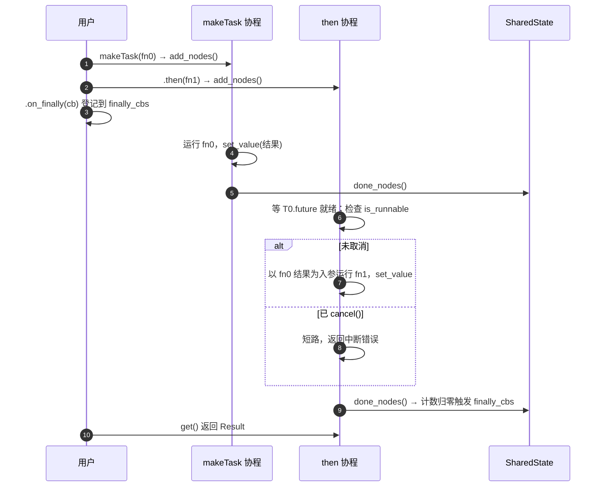
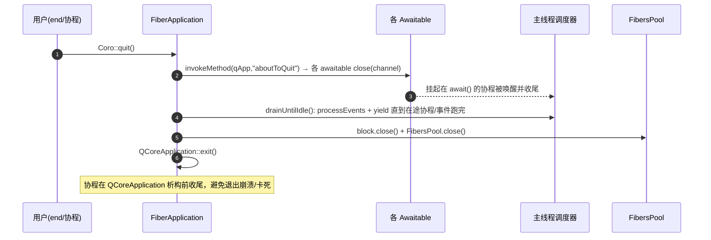

# AsyncTask 类图与时序图

> 图以 [Mermaid](https://mermaid.js.org/) 描述，GitHub/GitLab 及多数 Markdown 查看器可直接渲染。
> 配合 `doc/架构设计.md` 阅读。

## 1. 类图

### 1.1 整体分层与依赖

### 1.2 调度层

### 1.3 执行器层

### 1.4 任务层

### 1.5 await 层

## 2. 时序图

### 2.1 一次信号等待

### 2.2 协程跨线程调度

### 2.3 FiberTask 链式 then

### 2.4 Coro::quit() 安全退出

