# AsyncTask 软件设计说明

## 1. 文档标识
- 文档名称：AsyncTask 软件设计说明（SDD）
- 对应软件：AsyncTask 用户态协程异步框架（命名空间 `Coro`）
- 对应需求：`doc/需求规格说明.md`（SRS），本文档与其构成追溯关系（见第 6 章）
- 版本：见代码仓库提交记录

## 2. 引用文档
本设计说明为自包含文档：实现所需的结构、算法、图示均在本文内给出，不依赖其它设计文档。

| 编号 | 文档 |
|---|---|
| REF-1 | `doc/需求规格说明.md` 软件需求规格说明（SRS）——本设计的需求依据 |
| REF-2 | Boost.Fiber / Boost.Context 文档（≥ 1.89.0） |
| REF-3 | Qt 5 文档（≥ 5.12） |
| REF-4 | ISO/IEC 14882:2017（C++17） |

## 3. CSCI 级设计决策

从用户角度、不涉及内部实现细节，说明各构件将如何运行以满足需求及其设计原则；对系统状态/方式有依赖的，指明依赖性。

- **DD-1 有栈协程模型（满足 RX_COROUTINE_CREATION、RX_UNIFIED_AWAIT）**：采用 `boost::fiber` 有栈协程而非 C++20 无栈协程。用户无需 `co_await`，以阻塞式 `await()`/`get()` 顺序书写异步逻辑；协程暂停只让出线程、不阻塞线程。原则：与既有 Qt 同步 API 心智一致、迁移成本低。
- **DD-2 带优先级与线程亲和的自定义调度（满足 RX_COROUTINE_SCHEDULING、RX_QT_INTEGRATION）**：用户通过 `Priority` 与 `Affinity` 指定协程在何线程、以何优先级运行；Shared 协程可跨线程分发，Fixed/Sticky 协程绑定目标线程（便于 Qt 对象线程亲和）。**依赖性**：线程亲和须在协程创建时确定，运行期不迁移（见 RX_OTHER_AFFINITY）。
- **DD-3 统一等待载体 + coro() 工厂（满足 RX_UNIFIED_AWAIT）**：所有异步来源经单一重载入口 `coro(...)` 归一为 `Awaitable<T>` 或镜像原 Qt API 的包装器；通用来源继续按值提供 move-only `Awaitable<T>`，socket 包装器方法返回 `std::shared_ptr<Awaitable<T>>`。两者分别由既有及 shared-pointer 重载的 `await(a)`/`await_for(a,timeout)`/`generate(a)` 消费。原则：把“等待什么”（来源）与“怎么消费”（取一次/超时/流式）解耦，接口一致、可发现（参考 qcoro）。
- **DD-4 等待载体与 Qt 解耦（满足 RX_UNIFIED_AWAIT、RX_DESIGN_DECOUPLE）**：`Awaitable` 不含任何 Qt 类型，仅持共享 channel 与不透明生命周期守卫（`setOnClose`）；Qt 依赖集中在 `coro*` 工厂头，并按来源类型拆分文件。原则：可裁剪、可扩展非 Qt 来源。
- **DD-5 结果承载错误、异常不跨协程（满足 RX_RESULT_ERROR、RX_STRUCTURED_CONCURRENCY）**：协程结果统一用 `Result<T,E>`；协程内异常在边界转为错误码。原则：结构化并发的确定性，避免异常跨协程栈传播。
- **DD-6 主循环模型与安全退出（满足 RX_QT_INTEGRATION、RX_DESIGN_MAINLOOP）**：以 `Coro::exec()`（`block.wait`）为主循环；Qt 事件由各线程的**常驻泵协程**（每 Qt 线程一个，首次 `suspend_until` 用 `std::call_once` 懒启动、终身复用）在 worker 协程上下文里持续分发，从而 Qt 回调可安全做协程阻塞且不阻塞线程。`Coro::quit()` 依次：广播 `aboutToQuit` → 设全局退出标志令泵协程自行终止 → 排空在途协程与事件 → 停线程池 → `QCoreApplication::exit()`。**依赖性**：不得以 `QCoreApplication::exec()` 驱动（同线程互斥）；Qt 相关能力依赖宿主工程 `QT` 配置（core/network）启用。
- **DD-7 连接生命周期由 AutoDisconnect 统一管理（满足 RX_UNIFIED_AWAIT）**：socket 族包装器（TCP/本地 socket 与 server、UDP、SSL）的 Qt 信号连接由通用原语 `detail::AutoDisconnect` 承载——一组"到断连条件成立即整体断开"的连接，条件可为返回句柄失效（`untilExpired`，经 `setOnClose` 挂到 `Awaitable` 收尾钩子的急性 RAII）、某信号或信号+判断函数（`untilSignal`）。业务槽只捕获 channel、不捕获 `Awaitable`，从结构上消除"回调强持句柄"的引用环，使**返回句柄析构即取消订阅**；每次创建流式等待器互不残留、互不抢数据。原则：把"到某条件断开连接"这一横切关注点收敛到一个可测的原语，避免在每个包装器里重复 connect+登记+断连样板。**依赖性**：signal/future/`QIODevice` 等一次性或简单来源仍用 `setOnClose`+`bind_close`/watcher，不引入 `AutoDisconnect`。

## 4. CSCI 体系结构设计

### 4.1 CSCI 部件

构成本软件的模块（软件单元）、各自用途、模块间关系与结构如下；不需要额外硬件资源（纯软件库，随宿主工程编译）。四层自底向上、上层依赖下层，Qt 能力按宿主工程配置可选：


**图例说明**：本图给出五个软件部件（CSC_DETAIL 至 CSC_AWAIT）及其依赖方向，实线箭头读作“A 使用 B”，虚线为弱依赖。整体自上而下单向依赖、上层不被下层反向引用：

- **CSC_AWAIT（await 层）**：`coro()` 工厂与 `Generator` 均围绕 `Awaitable` 构建，`Awaitable` 组合 CSC_DETAIL 的 `ChannelHub`（生产者投递的分发端）与一条自己独占的 `FiberChannel`（消费端队列）传递数据。
- **CSC_TASK（task 层）**：`FiberTask` 用 CSC_DETAIL 的 `launch_properties()` 启动协程、用 `Result` 承载结果；`FiberApplication` 管理 CSC_EXECUTOR 的 `FibersPool`。
- **CSC_EXECUTOR（executor 层）**：为每个工作线程安装 CSC_SCHEDULER 的 `QtFiberScheduler`。
- **CSC_SCHEDULER（scheduler 层）**：`FiberScheduler` 使用 `FiberGlobalQueue` 与 `MetaContext` 完成“优先级 + 线程亲和”调度。
- 两条虚线：`coro ⇢ FiberApplication（退出广播）` 是唯一的“上层被动依赖”——等待器需在应用退出（`aboutToQuit`）时被关闭；`CSC_SCHEDULER ⇢ boost::fiber` 表示整套调度构建在 boost 有栈协程之上。
- **Qt 可选**：`QtFiberScheduler`/`QtFiberThread`/`FiberApplication`/`coro*` 在宿主工程未启用 Qt 时不编译，其余部分（`Result`/`FiberChannel`/`ChannelHub`/`FiberScheduler` 基类/`FiberTask`）仍可独立使用。

#### 4.1.1 基础层（CSC_DETAIL）
- **目录**：`coro/detail`
- **用途**：提供与具体调度/等待来源无关的基础设施——结果承载类型、跨线程安全数据队列、底层协程创建入口。响应 RX_RESULT_ERROR（结果承载）、RX_COROUTINE_CREATION（底层协程创建）。
- **主要内容**：`Result<T,E>`、`FiberChannel<T>`、`ChannelHub<T>`、`launch_properties`/`sleep`/`msleep`。
- **关系与结构**：被 CSC_AWAIT（`Awaitable` 组合 `ChannelHub` 与 `FiberChannel`）、CSC_TASK（`FiberTask` 用 `launch_properties`/`Result`）、CSC_SCHEDULER（`launch_properties` 依赖调度算法）依赖；自身不依赖其它部件（仅依赖 boost.fiber）。
- **硬件资源**：无特殊需求，随宿主工程一同编译为静态库。

#### 4.1.2 调度层（CSC_SCHEDULER）
- **目录**：`coro/executor/scheduler`
- **用途**：实现优先级 + 线程亲和 + 跨线程分发的自定义协程调度算法，并在支持 Qt 的线程上驱动 Qt 事件循环。响应 RX_COROUTINE_SCHEDULING、RX_QT_INTEGRATION。
- **主要内容**：`MetaContext`/`Affinity`/`Priority`、`FiberScheduler`/`QtFiberScheduler`/`QtLocalFiberScheduler`、`FiberGlobalQueue`/`FiberTaskQueue`。
- **类图**：


**图例说明**：`MetaContext` 继承 boost.fiber 的 `fiber_properties`，为每个协程附带三项调度属性——`Priority`、`Affinity`、`name`；`setPriority/setAffinity` 修改后通知调度器重新入队。`FiberScheduler` 实现 boost.fiber 的 `algorithm_with_properties<MetaContext>` 调度算法接口，是自定义调度的基类，并持有退出控制的静态状态（`s_exit_` 全局退出标志、`t_stop_` 逐线程退出标志）及 `signalExit()`/`stopCurrentThreadPump()` 两个退出控制入口；继承链 `FiberScheduler ← QtFiberScheduler ← QtLocalFiberScheduler`：`QtFiberScheduler` 覆写 `suspend_until`，持有 `eventloop`（构造即为本线程创建 Qt 事件派发器）与 `pump_once_`（保证常驻泵协程仅创建一次）；`QtLocalFiberScheduler` 再覆写 `pick_next` 供宿主线程（主线程/QThread）使用。`FiberGlobalQueue` 为全局单例，`buckets_` 按 `Affinity` 分桶、桶内按 `Priority` 降序保存 `MetaContext`，`index_` 支持按上下文移除。

- **关系与结构**：依赖 CSC_DETAIL；被 CSC_EXECUTOR（安装调度器）、CSC_TASK（`launch_properties` 间接触发调度）依赖。

#### 4.1.3 执行器层（CSC_EXECUTOR）
- **目录**：`coro/executor`
- **用途**：管理承载协程的线程（工作线程池、专用协程线程），提供“阻止线程退出但允许其调度协程”的基元。响应 RX_COROUTINE_SCHEDULING、RX_QT_INTEGRATION。
- **主要内容**：`FibersPool`、`QtFiberThread`、`FiberThreadBlock`。
- **类图**：


**图例说明**：`FiberThreadBlock` 是“阻止线程退出但允许其继续调度协程”的基元（`wait/close`）。`FibersPool` 为全局单例工作线程池，组合一个 `FiberThreadBlock`，其每个工作线程 `worker()` 安装 `QtFiberScheduler` 后 `block_.wait()` 挂起待命。`QtFiberThread` 是继承 `QThread` 的宿主线程，同样组合 `FiberThreadBlock`，在 `run()` 中安装 `QtLocalFiberScheduler`。两者区别在于所装调度器不同：线程池用 `QtFiberScheduler`（可就地绑定 Sticky、可取 Shared，通用工作线程）；宿主线程用 `QtLocalFiberScheduler`（只取 Fixed/Shared，适合已有事件循环归属的线程）。

- **关系与结构**：依赖 CSC_SCHEDULER（安装调度器）；被 CSC_TASK（`FiberApplication` 管理 `FibersPool`）依赖。

#### 4.1.4 任务层（CSC_TASK）
- **目录**：`coro/task`
- **用途**：提供结构化并发（任务链编排）与应用集成（生命周期、安全退出）。响应 RX_COROUTINE_CREATION、RX_STRUCTURED_CONCURRENCY、RX_QT_INTEGRATION。
- **主要内容**：`FiberTask<T>`/`SharedState`、`FiberApplication`。
- **类图**：


**图例说明**：`FiberTask<T>` 是一次任务的句柄，持有结果 future、共享状态 `SharedState`，以及本任务的优先级与亲和；`then/on_finally/cancel/get` 构成链式编排接口。一条任务链上的所有 `FiberTask` **共享同一个 `SharedState`**，其中 `pending_cnt` 记在途节点数、`is_runnable` 为取消标志、`finally_cbs` 收集结束回调；`add_nodes/done_nodes` 维护计数并在归零时触发全部回调。`FiberApplication` 继承 `QObject`，管理 `FibersPool` 并提供 `exec/quit` 的应用生命周期入口。

- **关系与结构**：依赖 CSC_DETAIL、CSC_EXECUTOR；被 CSC_AWAIT（等待器在应用退出时被关闭，弱依赖）依赖。

#### 4.1.5 等待层（CSC_AWAIT）
- **目录**：`coro/await`
- **用途**：提供统一的协程等待载体与消费接口，以及把各类 Qt/std 异步来源归一为等待器的工厂。响应 RX_UNIFIED_AWAIT。
- **主要内容**：`Awaitable<T>`、`Generator<T>`、`coro()` 工厂与 `Coro*` 包装器、`detail/{signalpack,lifecycle,autodisconnect}`。
- **类图**：


> **待办：以下各图的 svg 待重新导出。** `.mmd` 源文件均已按 `ChannelHub` 与状态模式的新结构更新，但本机 chromium 缺少运行时依赖、mermaid-cli 无法出图，因此**下列图片仍显示改动前的结构**，请以各图的图例说明与 `.mmd` 源文件为准：
>
> `sdd-01-sec-4-1`（detail 层新增 `ChannelHub`）、`sdd-05-csc_await`（类图）、`sdd-07`/`sdd-08`（数据流：hub 扇出到每消费者一条队列）、`sdd-09`（信号等待时序）、`sdd-10`（socket 流式时序）、`sdd-13`（退出时序）、`sdd-15`（生命周期）、`sdd-17`（状态模式，**尚无 svg**）。
>
> 重导步骤（需一次 root 安装 chromium 运行时依赖）：
>
> ```bash
> sudo apt-get install -y libnss3 libnspr4 libasound2
> for f in doc/img/*.mmd; do npx -y @mermaid-js/mermaid-cli -i "$f" -o "${f%.mmd}.svg"; done
> ```

**图例说明**：`Awaitable<T>` 是唯一的等待/数据载体，内部组合一个 `ChannelHub<T>`（`hub_`，一条数据流的分发端，生产者经 `channel()` 拿到并投递）与自己**独占**的一条 `FiberChannel<T>`（`queue_`，实际的消费端队列）。`setOnClose` 把清理回调挂到 hub 内联的 `AwaitableCloseGuard`；消费者归零（表中不再存在既存活又未关闭的队列）与最终析构二者中先发生的一方恰好一次执行清理。`await/await_for` 从 `queue_` 取值并以 `Result<T>` 返回。`FiberChannel<T>` 是 CSC_DETAIL 的跨线程安全通用队列，不含任何 `Awaitable` 痕迹；`ChannelHub<T>` 持一张消费者队列的 `weak_ptr` 表，负责把生产者的一次 `push` 分发给每一条存活且未关闭的队列。`Generator<T>` 通过 `generate(a)` 接管一个 Awaitable 实现流式迭代。通用 Awaitable 保持按值 move-only 接口，`CoroAbstractSocket`/`CoroTcpServer`/本地 socket/server/UDP/SSL 包装器的方法统一返回 `shared_ptr<Awaitable<T>>`，由消费者持有。`AutoDisconnect` 是这些 socket 族包装器的**连接生命周期管理器**：以 `on()` 按信号槽绑定业务、以断连条件（`untilExpired(awaitable)` 锚定返回句柄、`untilSignal` 锚定信号±判断）在条件成立时整组断开，并在自身析构时兜底断开。其业务槽**只捕获 hub（`channel()`）而不捕获 `Awaitable`**，故返回句柄一旦 `close`/析构即经 `untilExpired`（挂到 `setOnClose`）整组取消订阅——重复创建流式等待器互不残留、互不抢数据。**关键设计：`Awaitable` 不含任何 Qt 类型**——Qt 依赖全部集中在 `coro*` 工厂，因此等待层本体可脱离 Qt 使用（对应 DD-4、RX_DESIGN_DECOUPLE）。`Awaitable<T>::shared()` 提供广播消费：新建一个 `Awaitable`，复用同一个 `hub_`、挂一条属于自己的新队列；源与订阅者在 hub 的消费者表上**没有身份差别**，各自持有一条独立队列、各得全量，与直接消费源的抢占式消费者不竞争，不做 replay，退订随句柄析构自动完成（`weak_ptr` 兜底）。详见 §5.5。

- **关系与结构**：依赖 CSC_DETAIL；弱依赖 CSC_TASK（应用退出广播触发等待器关闭）。

### 4.2 执行方案

说明软件单元间的动态关系、相互作用、控制流/数据流、状态转换与对象/线程/协程的动态创建删除。各图以 SVG 形式给出（位于 `doc/img/`，由 Mermaid 源渲染，`.mmd` 源随图保存）。

#### 4.2.1 数据流上下文图（MS_DFD_CONTEXT）

框架作为单一加工，外接“用户代码”“Qt 异步来源”“boost.fiber 运行时”三个外部实体。


**图例说明**：三个外部实体：① **用户代码**——向框架提交可调用体与调度属性（优先级/亲和），取回 `FiberTask`/`Result`/`Awaitable`；② **Qt 异步来源**——向框架发出信号、到达数据、就绪事件，框架反向对其做 connect/read/write；③ **boost.fiber 运行时**——框架请求它创建/让出/恢复协程，它完成底层上下文切换来运行协程。要点：框架本身不产生业务数据，只在这三方之间**搬运数据与调度执行**。

#### 4.2.2 顶层数据流（MS_DFD_TOPLEVEL）

将框架分解为 5 个加工（P1–P5）与 3 个数据存储（D1–D3）。


**图例说明**：展示一条协程从创建、调度、消费到退出的完整数据走向：

- **P1 协程创建**：接收用户的可调用体与属性，把 detach 后的“就绪协程”写入 **D1 就绪协程集合**。
- **P2 调度**：从 D1 按亲和/优先级取出协程（attach）并 resume，把控制权交给运行等待的 P3 或运行任务链的 P4。
- **P3 等待与数据传递**：来源事件（信号/数据）流入并 `push` 进 **D2 数据队列**；消费侧 `pop`（无数据则让出协程），把 `Result`/`Generator` 交回用户。
- **P4 任务编排**：读写 **D3 任务链状态**（计数/取消/回调），把 `Result` 交回用户；计数归零触发结束回调，取消则令后继短路。
- **P5 应用与退出**：`quit` 时向 D2 广播 `close`、令 P2 停线程池后退出。

**数据存储说明**：

| 存储 | 实现 | 读者 → 写者 | 一致性保护 |
|---|---|---|---|
| D1 FiberGlobalQueue | `unordered_map<Affinity, set<MetaContext, greater>>` | P2 各线程读取/取出 ← P1、P2 写入 | 静态 `FiberScheduler::global_mtx` 串行化 |
| D2 ChannelHub + FiberChannel | `weak_ptr` 消费者表（`ChannelHub`）→ 各消费者一条 `mutex+condition_variable+deque`（`FiberChannel`） | P3 消费者 pop ← 来源槽 push（经 hub 分发到各消费者队列） | `boost::fibers::mutex`，锁顺序恒为 hub → queue；跨线程/跨协程安全 |
| D3 SharedState | `atomic pending_cnt / atomic is_runnable / vector finally_cbs` | 任务链各节点读写 | 原子变量 |

**关键数据流：一次信号等待**：


`obj` 发射信号时，框架注入的槽被调用，把信号参数按目数打包（无参→`void`、单参→值、多参→`tuple`），`push` 进该 `Awaitable` 的 `ChannelHub`（`channel()`），hub 转投进消费端的 `FiberChannel`；消费侧 `await(a)` 若此前无数据已让出协程，此刻被 `pop` 唤醒，取回 `Result<T>`。生产（槽）与消费（await）经 hub + 队列解耦，等待期间线程不被阻塞。

#### 4.2.3 一次信号等待时序（MS_SIGNAL_AWAIT）

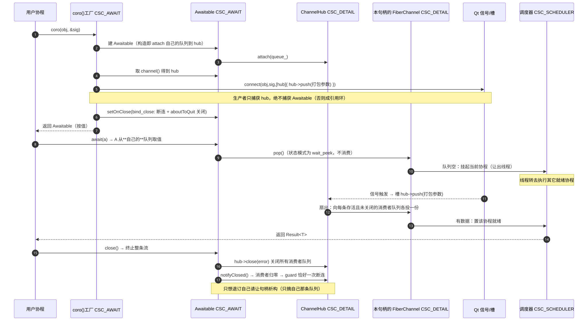

**图例说明**：**建立阶段（1–5）**：用户调用 `coro(obj,&sig)`，工厂建 `Awaitable`、取其 channel，`connect` 信号到“把参数 push 进 channel”的槽，用 `setOnClose` 注入断连与关机收尾，随后按值返回 `Awaitable`。**等待阶段（6–8）**：`await(a)` 调 `pop()`，队列空时挂起当前协程、让出线程，调度器转去执行其它就绪协程。**唤醒阶段（9–11）**：信号触发使槽 push 值，协程被置为就绪并在调度后从 `pop` 返回 `Result<T>`。**收尾（12）**：首次显式 `close` 或最终析构触发 guard，恰好一次断开信号连接。要点：等待期间该线程未被阻塞，仍在为其它协程与 Qt 事件服务。

#### 4.2.4 socket 流式读时序（MS_SOCKET_STREAM）

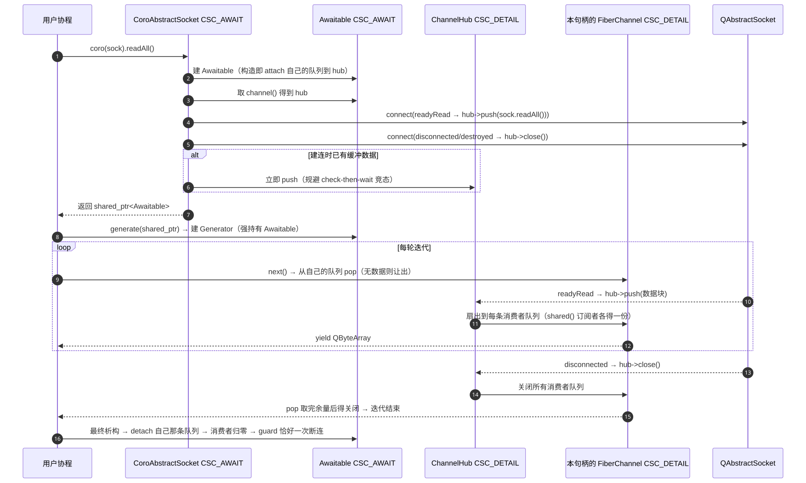

**图例说明**：**建立阶段**：`coro(sock).readAll()` 建 Awaitable，用 `AutoDisconnect` 把 `readyRead` 连接为“读取并 push 数据块”、把 `disconnected/error/destroyed` 连接为“关闭 channel 并整组断开”，并 `untilExpired(awaitable)` 把整组订阅锚到返回句柄；这些业务槽**只捕 channel、不捕 Awaitable**。若建连时套接字已有缓冲数据则**立即 push**，规避“先检查后等待”竞态导致的首包丢失。**消费阶段**：socket 方法返回的 `shared_ptr<Awaitable>` 由消费者/`generate` 持有，循环 `next()→pop()`——无数据则让出，`readyRead` 到来则产出一个 `QByteArray`。**终止阶段**：正常 socket 关闭给出 `no_message` 并让迭代自然结束；socket/local socket/SSL 错误为 typed error。**订阅生命周期**：返回句柄一旦 `close`/析构，`AutoDisconnect` 经 `untilExpired` 整组断开，故重复创建 `readAll` 互不残留、互不抢数据。所有 QObject 操作均在对象所属线程执行，跨线程动作使用 queued invocation。

#### 4.2.5 协程跨线程调度时序（MS_CROSS_THREAD_SCHED）

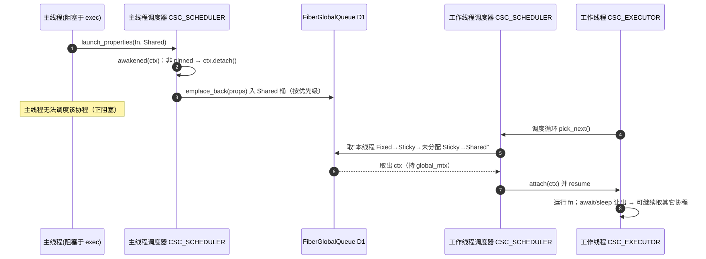

**图例说明**：展示 Shared 协程如何在“创建它的线程无法运行它”时被别的线程接手。主线程在 `exec()` 处阻塞，于其上创建一个 Shared 协程：调度器 `awakened` 判定其非 pinned，`detach` 后按优先级放入全局队列的 Shared 桶。由于主线程正阻塞、无法调度它，某工作线程在 `pick_next` 循环中按“本线程 Fixed→Sticky→未分配 Sticky→Shared”的顺序（持 `global_mtx`）取出它，`attach` 到本线程并 resume。要点：**全局队列 + detach/attach** 实现跨线程工作分发，使协程不被“卡住的线程”拖住。

#### 4.2.6 任务链时序（MS_TASK_CHAIN）

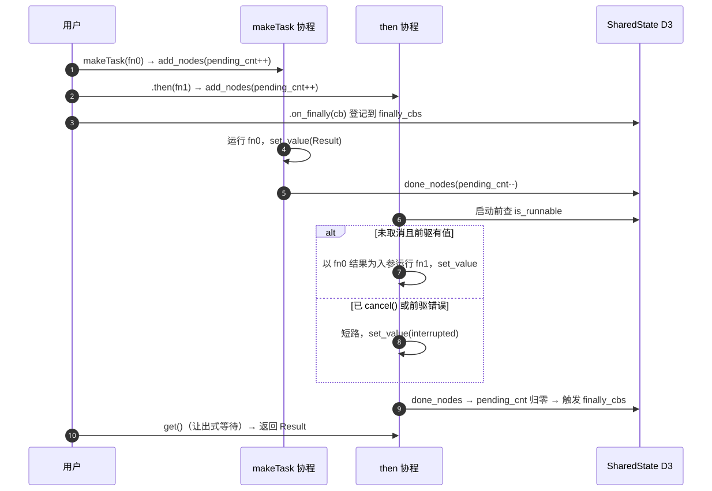

**图例说明**：展示 `makeTask → then → on_finally` 与 `cancel` 的协作。建立时每个节点 `add_nodes` 使在途计数加一，`on_finally` 把回调登记到共享状态。`makeTask` 的协程运行 `fn0`、写入结果、`done_nodes`。`then` 的协程在启动前检查取消标志：**未取消且前驱有值**时以前驱结果为入参运行 `fn1` 并写入结果；**已 `cancel()` 或前驱出错**时短路，写入“中断”错误。每个节点结束都 `done_nodes`，在途计数归零即触发全部结束回调。要点：一条链共享同一 `SharedState`，实现“依赖顺序执行 + 集中收尾 + 整体取消”；取消是协作式的，只令尚未开始的节点短路。

#### 4.2.7 安全退出时序（MS_SAFE_EXIT）

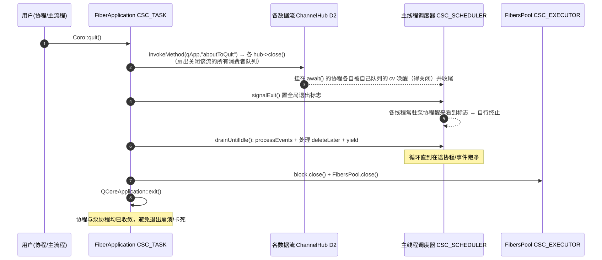

**图例说明**：解决“协程/泵协程活过 Qt 应用对象、退出期访问已销毁事件系统导致崩溃/卡死”的问题。**① 广播**：主动触发 `aboutToQuit`，各 `Awaitable` 借此关闭自己的 channel。**② 停泵**：`signalExit()` 置全局退出标志，各线程常驻泵协程醒来看到标志即自行终止，从而 `~scheduler` 不会因等待无限协程而挂死。**③ 唤醒收尾**：挂在 `await()` 的协程因 channel 关闭返回、就地收尾。**④ 排空**：`drainUntilIdle()` 循环执行 `processEvents`、派发 `deleteLater`、`yield`，直到在途协程与事件跑净。**⑤ 停机**：关闭线程阻塞与线程池，最后 `QCoreApplication::exit()`。

#### 4.2.8 协程调度状态图（MS_FIBER_STATE）


**图例说明**：单个协程在调度器眼中的生命周期。创建后进入**就绪**；被调度器 `pick_next` 取出并 attach 后进入**运行**；运行中若 `await/sleep` 且条件未满足则进入**挂起**（让出线程、不占用工作线程），若 `yield` 则让出时间片后重回**就绪**；挂起态在数据到达或超时被唤醒后回到**就绪**；协程函数返回则进入**终止**、栈被回收。关键：**“挂起”不阻塞线程**——这是“少量线程承载大量协程”的基础。

#### 4.2.9 Awaitable 生命周期状态图（MS_AWAITABLE_LIFECYCLE）


**图例说明**：等待器从建立到销毁的生命周期。`coro()` 建立并连接来源后进入**活动**——构造时即把自己独占的那条队列 attach 到 hub 上；来源经 `hub->push` 扇出后本队列进入**有数据**。队列模式下 `await` 取走数据回到**活动**（可反复，支撑流式消费）；状态模式下 `await` **不消费**，反复读返回同一个值，`discardPending()` 才使本句柄回到无值。来源析构或应用退出会 `hub->close()`，扇出关闭该流的所有消费者队列；队列模式下余量仍可继续取空，之后返回“无数据”错误使 `await`/`generate` 自然收敛，状态模式下则立即报终止（关闭是它唯一的终止信号）。**显式 `Awaitable::close()` 终止整条流**（关闭 hub 表里所有消费者队列），随后消费者归零触发清理；只想退订自己应让句柄析构——析构只 `detach` 自己那条队列，其他消费者不受影响。`AwaitableCloseGuard` 保证清理恰好一次，关闭后再析构不会重复断连。

#### 4.2.10 状态模式的值生命周期（MS_STATE_MODE）


**图例说明**：状态模式下"值"本身的状态机，从任一消费者句柄的视角看。以 `AwaitMode::State` 构造后处于**无值**——此时 `await()` 阻塞让出协程，`await_for()` 到期返回 `timed_out`（注意这与"流已终止"是两回事，前者流还活着）。生产者 `resolve(v)` 经 hub 扇出到每条消费者队列（容量恒为 1），进入**有值**：此后 `await()` 立即返回当前值且**不消费**，可反复读；再次 `resolve` 时新值自动挤掉旧值，读到的恒为最新。`discardPending()` 使**本句柄**回到无值、`await` 重新挂起，其他消费者不受影响。`close()` 或 hub 关闭进入**已终止**，此后 `await()` 返回失败的 `Result`，**最后那个值不再可读**——这是拿"最后的值"换"可检测的终止"，没有它 `await()` 将永远成功、永不报错，消费者无从得知源头已消亡。新 `shared()` 订阅者在 `attach()` 时由 hub 的 `latest_` 副本播种，因此一接上就能读到当前值；但状态模式**不做 replay**，接线之前就已存在的状态需由生产者补投一次（见 `doc/使用说明.md` §6.8.6）。

#### 4.2.10 FiberTask 节点状态图（MS_TASK_NODE_STATE）


**图例说明**：任务链中单个节点的状态流转。`add_nodes` 登记后进入**登记**；当前驱完成且任务链未被取消时进入**运行**，否则（已 `cancel` 或前驱出错）进入**中断**；运行成功写入结果值、中断写入“中断”错误，二者都汇入**完成**；`done_nodes` 使在途计数减一，归零时触发全部 `finally_cbs`。要点：取消是**协作式**的——只令尚未开始的节点短路，不打断正在运行的协程。

#### 4.2.11 对象/线程/协程的动态创建与删除（MS_DYNAMIC_LIFECYCLE）

- **工作线程**：`FibersPool`（CSC_EXECUTOR）首次使用时创建 N=`max(硬件并发,2)` 个工作线程，各安装 `QtFiberScheduler` 并 `block.wait()` 挂起（线程不退出但可调度协程）；`FibersPool::close()` 唤醒使线程退出。
- **协程（fiber）**：`launch_properties`/`makeTask`（CSC_DETAIL/CSC_TASK）动态创建 fiber，`awakened` 中 `detach` 交由调度器（D1）管理；协程函数返回即终止、栈回收。
- **常驻泵协程**：`QtFiberScheduler::suspend_until` 首次调用时用 `std::call_once` 创建，绑定当前线程、`detach`，终身循环分发 Qt 事件直到看到退出标志（全局 `signalExit()` 或本线程 `stopCurrentThreadPump()`）后自行终止。
- **Awaitable/channel**：信号/future 等 `coro()` 工厂按值返回 move-only `Awaitable`；socket 族包装器方法返回 `shared_ptr<Awaitable<T>>`。来源析构或 `aboutToQuit` 时关闭 channel；首次显式 `close` 或最终析构中先发生的一方通过 `AwaitableCloseGuard` 恰好一次执行 `setOnClose` 注入的断连清理。对 socket 族，`setOnClose` 触发的是 `AutoDisconnect::disconnectAll()`（`untilExpired` 挂钩），整组 Qt 连接随返回句柄寿命一并释放。
- **AutoDisconnect（socket 族订阅组）**：随包装器方法创建；`on()` 建立的每条业务连接、`add()` 登记的错误信号连接、`addCleanup()` 登记的定时器收尾，均在断连条件成立（句柄 `close`/析构、终止信号）或 `~AutoDisconnect` 时一次性释放。
- **退出**：`Coro::quit()`（CSC_TASK）时序见 §4.2.7——广播 `aboutToQuit` → `signalExit()` 停泵 → `drainUntilIdle` 排空 → 关线程池 → `exit()`。

### 4.3 接口设计

#### 4.3.1 接口标识和接口图

```
[用户代码]
   │ makeTask/then/get/cancel        (JK_TASK_APP 任务与应用接口, CSC_TASK/CSC_DETAIL)
   │ coro/await/generate             (JK_AWAIT 等待接口, CSC_AWAIT)
   │ Result/Awaitable/Generator/sleep(JK_BASE 基础接口, CSC_DETAIL/CSC_AWAIT)
   ▼
[AsyncTask]  ── JK_SCHEDULER_ALGO 调度算法内部接口(CSC_SCHEDULER↔boost.fiber) ── [boost::fiber]
             ── JK_GLOBAL_QUEUE 全局队列内部接口(CSC_SCHEDULER↔CSC_SCHEDULER)
```

三个外部（面向使用方）接口 JK_TASK_APP、JK_AWAIT、JK_BASE，以及两个内部（框架自用）接口 JK_SCHEDULER_ALGO、JK_GLOBAL_QUEUE。外部接口以 C++ 头文件形式提供，宿主工程通过 `include(AsyncTask.pri)` 引入；内部接口不对使用方开放。

#### 4.3.2 任务与应用接口（JK_TASK_APP）
- 优先级：高（核心对外 API）。
- 接口类型：C++ 函数/成员函数调用（头文件 `task/fibertask.h`、`task/fiberapplication.h`）。
- 数据元素：`fn`（可调用体）、`Priority`、`Affinity`、`Result<T>`。
- 通信方式：同步函数调用；`get()` 为协程内让出式阻塞。
- 协议特征：`makeTask(fn,pri,affine)→FiberTask`；`then/on_finally/cancel/get`；应用 `installFiberApplication/exec/quit`。

#### 4.3.3 等待接口（JK_AWAIT）
- 优先级：高。
- 接口类型：C++ 函数调用（头文件 `await/coro.hpp` 伞头或按需子头）。
- 数据元素：Qt 信号指针/Qt IO 对象/future；输出 `Awaitable<T>`/包装器/`Generator<T>`/`Result<T>`。
- 通信方式：工厂建立来源到 `ChannelHub` 的连接；`await`/`await_for` 为让出式阻塞，`generate` 为迭代。
- 协议特征：`coro(...)` 归一 → `await(a)`/`await_for(a,timeout)`/`generate(a)`；无参信号→`void`，多参→`tuple`；超时→`timed_out`，关闭→`no_message`。

#### 4.3.4 基础接口（JK_BASE）
- 优先级：中。
- 接口类型：C++ 类型/函数（`detail/result.hpp`、`await/awaitable.hpp`、`await/generator.hpp`、`detail/asyncdefine.h`）。
- 数据元素：`Result<T,E>`、`Awaitable<T>`、`Generator<T>`、时长。
- 通信方式：值语义/共享 channel。
- 协议特征：`Result::{has_value,value,error,value_or}`；`Awaitable::{channel,setOnClose,await,await_for,resolve,close}`；`sleep/msleep`。

#### 4.3.5 调度算法内部接口（JK_SCHEDULER_ALGO）
- 优先级：高（框架正确性核心）。
- 接口类型：实现 boost.fiber `algorithm_with_properties<MetaContext>` 虚接口。
- 数据元素：`context*`、`MetaContext&`。
- 通信方式：boost.fiber 回调；`awakened/pick_next/suspend_until/notify/property_change`。
- 协议特征：须遵守 boost.fiber 对返回可运行上下文、`detach/attach`、pinned 上下文处理的约定。

#### 4.3.6 全局队列内部接口（JK_GLOBAL_QUEUE）
- 优先级：高。
- 接口类型：`FiberGlobalQueue` 成员函数。
- 数据元素：`MetaContext`、`Affinity`。
- 通信方式：调用方须持有 `FiberScheduler::global_mtx`。
- 协议特征：`emplace_back/pop_front_affinity/getQueueSize/remove_*`。

## 5. CSCI 详细设计

本章给出各软件单元的详细设计（单元设计决策、约束、软件逻辑、执行过程、时序、数据流、类图），细度以“可据此直接编码”为准；每个 CSU_xxx 对应 §4.1 中的同名 CSC_xxx 部件，结构性类图见 §4.1，本章聚焦逻辑与算法。

### 5.1 基础层详细设计（CSU_DETAIL）

**单元设计决策**：`Result<T,E>` 以“是否有值”标志 + 联合体存放值/错误，避免异常跨协程传播（对应 DD-5）；`FiberChannel<T>` 用 fiber 版 `mutex`/`condition_variable` 实现，替代 boost 原生 `unbuffered_channel`（其在非协程线程 pop 会崩溃）。

**设计约束**：并发访问受锁保护；不持有异常对象，一切失败以错误码表达（对应 RX_RESULT_ERROR）。

**软件逻辑**：
- **Result<T, E=std::error_code>**：字段（设计）`bool has_value_`；`union { T value_; E error_; }`。`void` 特化不含 `value_`。方法：`has_value()`/`operator bool()`；`value()`（仅成功时有效）；`error()`；`value_or(default)`。类型萃取：`result_inner_type<R>`（取内层 T）、`flatten_result_type<R>`（`Result<Result<T>>`→`Result<T>`），用于协程返回值与等待结果的统一组合。
- **FiberChannel<T>**：字段 `boost::fibers::mutex mtx_`；`boost::fibers::condition_variable cv_`；`std::deque<T> q_`；`bool closed_`；`std::uint32_t capacity_`（队列容量上限，默认 `kDefaultCapacity=1024`，0 表示无限，见下）。`push(v)`：加锁；已关闭则拒绝；否则入队并 `cv_.notify_all()`（详见下）。`pop() -> Result<T>`：加锁，`cv_.wait` 直到队非空或已关闭；关闭且空→返回“无数据”错误；否则取队首并弹出。`pop_wait_for(timeout) -> Result<T>`：带超时版本，超时→返回“超时”错误。`close()`：置 `closed_` 并 `cv_.notify_all()`，唤醒全部等待者收敛。使用 fiber 版 mutex/cv，等待时**让出协程而非阻塞线程**。
  **`wait_peek(out)`/`wait_peek_for(out,timeout)`（非破坏性读取）**：等待条件与 `pop` 相同（队非空或已关闭），但取到队首后**只拷贝、不弹出**——元素仍留在队列里，可被反复读到同一个值，是 `ChannelHub` 状态模式（消费者队列容量恒为 1、非破坏性读取）赖以实现的基础。终止语义与 `pop` **刻意不同**：`pop` 在"已关闭但队列仍有排队值"时会先把余量取完，`wait_peek` 只要 channel 已关闭就直接返回 `closed`，不论队列是否仍有值，`out` 也不写入。原因：peek 不消费，"取完余量"这个概念对它不成立；更关键的是，这是"状态"类用法唯一可能拿到的终止信号——若关闭后 `wait_peek` 仍返回成功，读取方将永远成功、永不报错，无从得知来源已经终止（这正是本次改动语义 3：拿"最后的值不可读"换"可检测的终止"）。
  **`push` 由 `notify_one` 改为 `notify_all`**：`wait_peek` 的等待者不消费元素，若仍用 `notify_one`，一次 `push` 只会唤醒挂在同一条 channel 上的多个 peek 等待者中的一个，其余静默漏醒。改为 `notify_all` 对 `pop`/`pop_wait_for`/`value_pop` 一侧是安全的——它们均使用带谓词的 `wait`，多余的唤醒会自行判断条件不满足后重新等待，代价仅是多消费者抢同一条队列时的一次"惊群"，不影响正确性。
  **容量与丢弃**：`capacity_` 紧跟 `closed_` 声明，复用其后原本存在的填充字节，不增加 `sizeof`（详见 §5.5 的存储讨论）。`push` 入队后若 `capacity_ != 0 && q_.size() > capacity_`，循环 `pop_front` 丢弃队首最旧值直至队列大小回落到上限，净大小停留在上限，不阻塞生产者也不让 `push` 返回失败；丢弃不改变 `closed_`，也不修改已保留的 `close_error_`。`setCapacity(n)` 在持锁状态下更新 `capacity_`；若新值小于当前排队数则立即从队首丢弃直至不超过新容量；`n=0` 取消上限，退回旧的无界行为。`FiberChannel` 本身不知道有多少个消费者共用同一条数据流——向一条数据流的所有消费者级联容量是 `ChannelHub::setCapacity` 的职责：它遍历消费者表，对每条存活队列调用同名方法，并把新值记为后续 `attach()` 挂载的默认容量，因此源上调用一次即可让所有订阅者（含 `a->shared()->shared()` 这类链式订阅）跟着改变上限，不必抢在订阅之前调用，详见 §5.5。
- **launch_properties / sleep / msleep**：`launch_properties(fn, pri, affine, name)` 以 `MetaContext(pri,affine,name)` 为 fiber 属性创建 `boost::fibers::fiber` 执行 `fn` 并 `detach` 交调度器管理，是“带调度属性启动协程”的统一低层入口。`sleep(s)`/`msleep(ms)` 包装 `boost::this_fiber::sleep_for`，休眠期让出线程。

**数据流/时序**：见 §4.2.2（D2 数据存储由 `ChannelHub` + `FiberChannel` 实现）；类图见 §4.1.5（`Awaitable *-- FiberChannel`、`Awaitable --> ChannelHub`、`ChannelHub o-- FiberChannel`）。

### 5.2 调度层详细设计（CSU_SCHEDULER）

**单元设计决策**：`FiberGlobalQueue` 按 `Affinity` 分桶、桶内按 `Priority` 排序实现优先级+亲和；`QtFiberScheduler` 用“常驻泵协程 + 基类 cv 阻塞”而非早期方案（maxtime 版 `processEvents` 会剥离 `WaitForMoreEvents` 导致空闲满核空转；一次性协程方案虽不空转但反复创建协程有开销）——常驻泵协程首次 `suspend_until` 时 `std::call_once` 创建、终身复用，`suspend_until` 自身委托基类做真正的 cv 阻塞（对应 DD-6、RX_DESIGN_MAINLOOP）。

**设计约束**：跨线程队列访问由静态 `global_mtx` 串行化；须遵守 boost.fiber 上下文约定；协程运行期不得更改线程亲和（RX_OTHER_AFFINITY）；泵协程必须在线程结束（`block.wait()` 返回）前终止，否则 boost.fiber 的 `~scheduler` 会等待残留协程而挂死——退出控制放在基类 `FiberScheduler` 而非 `QtFiberScheduler`，使所有需要退出调度器的场景可调用统一入口。

**软件逻辑**：
- **调度属性 MetaContext / Priority / Affinity**：`Priority` 枚举 `Low/Normal/High`。`Affinity`：`{ AffinityMode mode; optional<thread_id> fixed_id; }`，模式 `Shared/Sticky/FixedId`，工厂 `shared()/sticky()/fixed(id)`。`MetaContext : boost::fibers::fiber_properties` 持 `priority_/affinity_/name_`；`setPriority/setAffinity` 修改后 `notify()` 触发调度器 `property_change`；定义按优先级的比较（供就绪集合降序排序）。
- **就绪协程集合 FiberGlobalQueue**：结构 `unordered_map<Affinity, set<MetaContext, greater<>>> buckets_`（按亲和分桶、桶内按优先级降序）；`unordered_map<context*, MetaContext> index_`（按上下文检索，用于移除）。方法：`emplace_back(meta)` 入对应桶；`pop_front_affinity(affine)` 从匹配桶取优先级最高者；`remove(ctx)`；`getQueueSize()`；单例 `instance()`。所有访问在持有 `global_mtx`（静态）时进行。
- **FiberScheduler（核心调度算法）**：继承 `boost::fibers::algo::algorithm_with_properties<MetaContext>`。本地结构：`main_queue_`（本线程 pinned 上下文就绪队列）；`mtx_`/`cnd_`/`flag_`（`suspend_until` 的 cv 等待原语）；`static std::atomic_bool s_exit_`（全局退出标志）；`static thread_local std::atomic_bool t_stop_`（逐线程退出标志）。
  - `awakened(ctx, props)`：① `ctx` 为 pinned（本线程主/调度上下文）→ 入 `main_queue_`；② 否则 `ctx->detach()`，持锁 `FiberGlobalQueue::emplace_back(props)`。
  - `pick_next() -> context*`：持锁按序尝试① 本线程 Fixed → ② 本线程 Sticky → ③ 未分配 Sticky（就地绑定到本线程）→ ④ Shared；命中则 `ctx->attach()` 到本线程返回；否则取 `main_queue_`；皆空返回 `nullptr`。
  - `has_ready_fibers()`：`main_queue_` 非空，或全局队列存在可被本线程取用者。
  - `suspend_until(tp)`：无就绪时以 `cnd_.wait_for` 挂起线程至 `tp` 或被 `notify()` 唤醒（真正阻塞，不空转）。
  - `notify()`：置 `flag_` 并 `cnd_.notify_all()`。
  - `property_change(ctx, props)`：属性变更后若已就绪则解除就绪态并重新调度（受 RX_OTHER_AFFINITY 限制：运行期迁移线程不受支持）。
  - `signalExit()`（静态）：置 `s_exit_ = true`（`Coro::quit()` 调用）。
  - `stopCurrentThreadPump()`（静态）：置 `t_stop_ = true`（单线程提前退出时调用，由 `FiberThreadBlock::wait()` 在返回前自动调用，见 §5.3）。
  - 约束：严格遵守 boost.fiber 对 `detach/attach`、返回可运行上下文、pinned 上下文不得 detach 的约定。
- **QtFiberScheduler / QtLocalFiberScheduler**：`QtFiberScheduler : FiberScheduler` 持有 `QEventLoop eventloop`（构造即创建本线程 Qt 事件派发器）与 `std::once_flag pump_once_`。`suspend_until(tp)` 覆写：先 `std::call_once(pump_once_, ...)` 创建常驻泵协程——`launch_properties([this]{ while(!s_exit_ && !t_stop_){ eventloop.processEvents(AllEvents); Coro::msleep(interval); } }, Priority::High, Affinity::fixed(this_thread))`，`detach`；随后调用 `FiberScheduler::suspend_until(tp)` 委托基类做真正阻塞。泵协程运行在 worker 协程上下文（而非调度器 dispatcher 上下文），因此其分发的 Qt 回调里可安全执行会让出的协程阻塞，不会因在 dispatcher 上下文 yield 而崩溃。`QtLocalFiberScheduler : QtFiberScheduler` 覆写 `pick_next` 只取 Fixed 与 Shared（不把新 Sticky 就地绑定到宿主线程），用于 Qt 主线程/QThread 等宿主线程。

**执行过程/时序**：见 §4.2.5（跨线程调度）、§4.2.7（安全退出中的停泵步骤）、§4.2.8（协程调度状态图）。

**数据流**：见 §4.2.2 D1（FiberGlobalQueue）。

**类图**：见 §4.1.2。

### 5.3 执行器层详细设计（CSU_EXECUTOR）

**单元设计决策**：`FiberThreadBlock` 承担“阻止线程退出但允许协程调度”的通用基元，退出路径统一由 `wait()` 内部处理（调用方无需逐一处理内部资源收尾）。

**设计约束**：`FibersPool` 为进程内单例；工作线程数默认 `max(硬件并发,2)`。

**软件逻辑**：
- **FiberThreadBlock**：字段 fiber `mutex`+`condition_variable`；`bool closed_`。`wait()`：在协程内等待直至 `closed_`（等待期间该线程仍在其调度器中调度其它协程）。`close()`：置 `closed_` 并 `notify_all()`。
- **FibersPool（工作线程池，单例）**：字段 `vector<thread> tds_`；`FiberThreadBlock block_`。`instance()`：首次调用创建 N=`max(硬件并发,2)` 个工作线程，每线程 `worker()`：安装 `QtFiberScheduler` → `block_.wait()`（线程不退出、可调度协程）。`close()`：`block_.close()` 唤醒各线程使其退出。
- **QtFiberThread**：`QThread` 子类；`run()`：安装 `QtLocalFiberScheduler` 并 `block.wait()`，成为可承载 Fixed 协程的宿主线程；`quit()`：`block.close()`。

**执行过程/时序**：见 §4.2.11（工作线程动态创建与删除）。

**类图**：见 §4.1.3。

### 5.4 任务层详细设计（CSU_TASK）

**单元设计决策**：`FiberTask` 与 `SharedState` 分离——句柄可随意拷贝/移动传递，链上所有节点共享同一份状态；异常在协程边界统一转错误码（对应 DD-5）。`FiberApplication::quit()` 的收尾顺序固定（广播→停泵→排空→停池→退出），确保协程与事件系统在 Qt 应用对象析构前完全收敛。

**设计约束**：异常在协程边界转错误码；主循环用 `Coro::exec()`。

**软件逻辑**：
- **SharedState（任务链共享状态）**：字段 `atomic<int> pending_cnt`（在途节点数）；`atomic<bool> is_runnable`（取消标志，初值 true）；`vector<function<void()>> finally_cbs`。`add_nodes()`：`pending_cnt++`。`done_nodes()`：`--pending_cnt`；归零时依次执行 `finally_cbs`。
- **FiberTask<T>**：字段 `shared_ptr<promise/future<Result<T>>>`；`shared_ptr<SharedState> state_`；`Priority pri_`；`Affinity affine_`。`makeTask(fn,pri,affine)`：建 `SharedState`→`add_nodes`；`launch_properties` 启动协程：运行 `fn`（异常在边界转错误码）→ `set_value(Result)` → `done_nodes`；返回 `FiberTask`。`then(fn[,pri,affine])`：`add_nodes`；启动后继协程：等前驱 future 就绪；若 `!is_runnable` 或前驱为错误 → `set_value(interrupted)`；否则以前驱结果为入参运行 `fn` → `set_value`；末尾 `done_nodes`。后继默认继承 `pri_/affine_`。`on_finally(cb)`：`finally_cbs.push_back(cb)`。`cancel()`：`is_runnable = false`。`get()`：等待 future（协程内让出）并返回 `Result<T>`。
- **FiberApplication**：`installFiberApplication()`：主线程安装 `QtLocalFiberScheduler`，启动 `FibersPool`。`exec()`：主线程 `block.wait()`。`quit()`：① `QMetaObject::invokeMethod(qApp,"aboutToQuit",DirectConnection)` 广播关机；② `FiberScheduler::signalExit()` 置全局退出标志，令各线程常驻泵协程自行终止；③ `drainUntilIdle()`：循环 `processEvents` + 派发 `DeferredDelete` + `this_fiber::yield`，直至就绪集合空闲；④ `block.close()` + `FibersPool::close()`；⑤ `QCoreApplication::exit()`。

**执行过程/时序**：见 §4.2.6（任务链）、§4.2.7（安全退出）、§4.2.10（FiberTask 节点状态图）。

**类图**：见 §4.1.4。

### 5.5 等待层详细设计（CSU_AWAIT）

**单元设计决策**：`Awaitable` 内部组合一个共享的 `ChannelHub`（生产者只捕获 `channel()` 拿到的 hub，避免引用环）与自己独占的一条 `FiberChannel`；hub 内联 `AwaitableCloseGuard` 承载 `setOnClose` 注入的 RAII 断连，消费者归零时执行一次；signal/future/`QIODevice` 等一次性或简单来源由 `coro()` 工厂注入 `bind_close`；**socket 族**（TCP/本地 socket 与 server、UDP、SSL）的连接则统一由 `detail::AutoDisconnect` 管理（对应 DD-7）——业务槽只捕 channel、断连条件 `untilExpired(awaitable)` 挂到返回句柄的 `setOnClose`，句柄析构即整组断开，杜绝"回调强持 `Awaitable`"的引用环（该引用环曾导致每次新建 `readAll` 残留 `readyRead` 订阅、互相截数据而使流 stall）；`readAll` 建连时若已有缓冲数据立即投递（规避 check-then-wait 竞态）；`generate(a)` 以 shared_ptr 持有 `Awaitable` 适配调度器对 fiber 函数的拷贝。

**设计约束**：`Awaitable` 不含 Qt 类型；Qt 依赖集中在 `coro*` 头（对应 DD-4、RX_DESIGN_DECOUPLE）。

**软件逻辑**：
- **Awaitable<T>**：字段 `shared_ptr<ChannelHub<T>> hub_`（构造即 `make_shared`，一条数据流的分发端）；`shared_ptr<FiberChannel<T>> queue_`（自己独占的消费端队列）。默认构造新建 hub 与 queue 并 `hub_->attach(queue_)`；`explicit Awaitable(AwaitMode)` 以指定模式构造 hub（其余同默认构造）；订阅构造（供 `shared()` 使用）复用传入的 hub、新建自己的队列并 attach——因此自动继承 hub 的模式。析构 `hub_->detach(queue_.get())`。`void` 特化用 `ChannelHub<int>`/`FiberChannel<int>` 承载“发生一次”信号。`channel()` 返回 `hub_`（供生产者捕获）；`setOnClose(fn)` 透传给 `hub_->setOnClose(fn)`，注入的回调挂在 hub 内联的 `AwaitableCloseGuard` 上，在消费者归零（表中不再存在既存活又未关闭的队列）时于 hub 锁外恰好执行一次。
  **队列模式（默认）**：`await()`=`queue_->pop()`；`await_for(t)`=`queue_->pop_wait_for(t)`——与本次改动前逐字相同。
  **状态模式**（`hub_->isState()` 为真）：状态模式下队列容量恒为 1，`await()`/`await_for(t)` 都改走**自己的** `queue_->wait_peek(value)`/`wait_peek_for(value,t)`——非破坏性读取：容量 1 意味着新值自动挤掉旧值、读取又不消费，天然就是"最新值，可反复读"语义。终止判定仍是 `wait_peek` 自己的语义：只要 `queue_` 已关闭就返回 `close_error()`，不论是否仍有值——这是状态模式唯一可能的终止信号。
  `resolve(v)`=`hub_->push(v)`：状态模式下 `push` 与队列模式共用同一段 `consumers_` 遍历、照常向每条消费者队列扇出（容量 1 自动丢旧留新），并非只写某个共享的格子；hub 另外额外保留一份 `latest_`（`std::unique_ptr<T>`）副本，只用于在 `attach()` 时给新订阅者播种初值，它本身没有等待者。`close()`（默认 `no_message`）转发 `close(error)`，`close(error)` 关闭 hub 表里**所有**消费者队列并跑一次清理——**终止整条流**，不是只关自己这一路；想只退订自己，析构句柄即可（只摘自己那条队列）。`isClosed()` 查 `queue_->is_closed()`，供 `Generator` 判断自己这一路是否收尾。`discardPending()`：队列模式与状态模式下都等价于 `queue_->discard_pending()`——**只清自己这一路**；状态模式下 hub 的 `latest_` 播种副本不受影响，此后新建的 `shared()` 订阅者仍会被播种为那个值，而调用过本方法的句柄自己却读不到它；要清空整条流（含 `latest_`）用 `channel()->discard_pending()`。按值 Awaitable 保持 move-only、跨线程安全；socket 方法改以 shared handle 返回。
- **Generator<T> 与 generate(a)**：`Generator<T>` 基于协程的产出序列，提供 `begin()/end()`（输入迭代器）、`next()`、`close()`。`generate(Awaitable<T>)` 接管按值 Awaitable；`generate(shared_ptr<Awaitable<T>>)` 强持有 socket 流直到迭代结束。正常关闭结束迭代；`await_for` 的 `timed_out` 只结束本次等待，绝不关闭来源或取消 socket 操作。
- **AutoDisconnect（socket 族连接生命周期管理器）**：`std::enable_shared_from_this` 的连接组，字段 `vector<QMetaObject::Connection> connections_`、`vector<function<void()>> cleanups_`、`bool disconnected_`，互斥保护。`on(sender,sig,slot)` 建立并登记业务连接；`add(conn)` 登记已建连接（如跨 Qt 版本的错误信号）；`addCleanup(fn)` 登记随组清理的回调（如停止/删除 server 的 10 ms 探测定时器）；`untilExpired(awaitable)` 用 `awaitable->setOnClose([weak_this]{ disconnectAll(); })` 把断连锚到返回句柄的 close/析构（只持 `weak_ptr`、不延长句柄寿命）；`untilSignal(obj,sig[,pred])` 在某信号[且判断成立]时断开整组；`disconnectAll()` 在锁外一次性断开全部连接并运行清理，幂等，断开后新登记的连接/回调立即断开/执行。RAII：`~AutoDisconnect` 兜底 `disconnectAll()`。
- **coro() 工厂族与公共设施**：signal/future/`QIODevice` 等来源建 Awaitable、连接来源把数据 push 进 channel、`setOnClose(bind_close(...))` 注入断连与关机收尾后按值返回；**socket 族**工厂改用 `AutoDisconnect`：业务槽 `push` 进 channel、终止信号（disconnected/error/acceptError/stateChanged 等）`close` channel 并 `disconnectAll()`、源析构/`aboutToQuit` 关闭并断开、`untilExpired(awaitable)` 绑定句柄寿命；server 的 `discard_pending()` 用**独立于组的原始连接**挂到 `destroyed`，以便消费者先 `close` 后仍能清理悬空排队指针。socket 族方法一律返回 `shared_ptr<Awaitable<T>>`。来源包括 `corosignal.hpp`（信号）、`corofuture.hpp`（future）、`coroiodevice.hpp`、`corosocket.hpp`（完整 TCP）、`corotcpserver.hpp`、`corolocalsocket.hpp`、`corolocalserver.hpp`、`coroudpsocket.hpp` 和 `corosslsocket.hpp`。QObject 调用仅在对象所属线程执行，跨线程动作使用 queued invocation。UDP 每次产生完整 `QNetworkDatagram`（payload 和地址/端口 metadata 不丢失）；`sslErrors()` / `peerVerifyError()` 的证书和 peer verification 事件为 `qt.ssl`，`QAbstractSocket` 的传输或握手失败可以为 `qt.socket`，从不自动 `ignoreSslErrors()`。
- **ChannelHub<T> 与 Awaitable::shared()（`channelhub.hpp`）**：一条数据流的分发端。字段 `boost::fibers::mutex mtx_`；`std::vector<std::weak_ptr<FiberChannel<T>>> consumers_`（消费者队列表，弱引用，强引用只在各 `Awaitable` 手里）；`std::atomic_bool closed_`；`std::uint32_t capacity_`（默认 `FiberChannel<T>::kDefaultCapacity`，作为后续 `attach()` 挂载的默认容量）；`std::error_code close_error_`；`std::unique_ptr<T> latest_`（状态模式下的播种副本，见下）；`detail::AwaitableCloseGuard guard_`（内联的清理钩子，从旧版 `Awaitable` 迁入本文件）。`Awaitable::shared()` 语义为：新建一个 `Awaitable`，复用同一个 `hub_`、挂一条属于自己的新队列到 hub 的消费者表上——**平表**，源与订阅者在表上没有身份差别，`a->shared()->shared()` 只是同一张表上多一项，不再是链式的镜像树。

  **`AwaitMode` 与 `latest_` 播种副本**：`enum class AwaitMode { Queue, State }`，构造 `ChannelHub` 时确定、此后不可变（无 setter），由 `stateMode_`（`bool`）标志记录，`isState()` 直接读该标志。**状态模式 = 容量恒为 1 的消费者队列 + 非破坏性读取**：`attach()` 时把新挂上的队列容量设为 1；`push` 与队列模式共用同一段 `consumers_` 遍历、照常扇出，容量 1 令每条消费者队列自动丢旧留新，天然就是"最新值"语义，读取则由 `Awaitable::await()` 改走该消费者自己队列的 `wait_peek()`（不消费，可反复读，见下与 §5.1）。不存在任何"共享状态格"，也没有单独的状态存取方法——每个消费者读的是自己的队列。
  状态模式下 hub 自身只多做一件事：额外维护 `latest_`（一份 `std::unique_ptr<T>`），仅用于 `push` 成功后同步更新、并在 `attach()` 时给新订阅者播种初值（新队列 `push` 一次 `*latest_`），它本身没有等待者、不参与消费。
  - `push(v)`：与队列模式走同一段 `consumers_` 遍历分支，向每条存活的消费者队列扇出；状态模式下额外 `latest_ = std::make_unique<T>(value)` 更新播种副本。内存占用与消费者数量成正比，是 **O(N)**（每个消费者一条容量 1 的队列，外加 hub 一份 `latest_`），不是 O(1)。
  - `close(error)`：置 `closed_` 后照常遍历 `consumers_` 逐条关闭——与队列模式相同，不单独处理 `latest_`（`latest_` 只在 `attach()` 时读取，关闭不影响它）。状态模式下"关闭"是唯一的终止信号（详见 `wait_peek` 的语义，§5.1）。
  - `discard_pending()`：状态模式下额外重置 `latest_`（回到无值），再照常遍历清空每条消费者队列——这是 hub 级的清空入口，作用于整条流；`Awaitable::discardPending()` 只清调用者自己的队列、不触达这里，见上文。
  - `setCapacity(n)`：状态模式下直接返回、忽略传入的 `n`——状态天然容量为 1，容量概念对它不适用，是显式的空操作而非静默失败。
  - `capacity()`：状态模式下恒返回 `1`，不查 `capacity_` 字段。
  - `attach`/`detach`/`notifyClosed`/`markExhausted`（消费者归零判定、清理钩子触发）**不因模式而改变**：状态模式下 `consumers_` 表和空指针检查逻辑照常工作，唯一的差异是 `attach()` 会把新队列容量设为 1 并用 `latest_`（若非空）播种一次。

  **挂载/摘除**：`attach(queue)`（`Awaitable` 构造时调用）把队列的 `weak_ptr` 追加进 `consumers_`；若 hub 已关闭则改为直接以 hub 记录的终止原因关闭该队列、不入表，避免消费者永久挂起。`detach(queue)`（`Awaitable` 析构时调用）从表中移除对应槽位，顺带以 swap-and-pop 剔除失效槽位，随后判定消费者是否归零。`attach`/`detach`/`notifyClosed` 均为 public——旧版曾有一个私有的镜像注册方法，必须收口（private + friend）是因为两个同类型的 channel 能互相注册为对方的镜像而成环；`ChannelHub` 与 `FiberChannel` 是两个不同的类型层，结构上无法互相挂载，环不可能构造出来，故无需同样的收口，public 同时让 `ChannelHub` 可脱离 `Awaitable` 独立单测。

  **`close()` 不摘表，析构才摘**：`Awaitable::close(ec)` 转发给 `hub_->close(ec)`，**终止整条流**——遍历 `consumers_` 把每条存活的消费者队列都标记关闭，随后跑一次清理；但这一步**不**从 `consumers_` 里移除任何槽位，真正的摘除只发生在各自的 `Awaitable` 析构（`detach`）。这条约束由 `corotcpserver.hpp:135-137` 的用法逼出：消费者先 `close()` 掉流、再 `delete server`，`server` 析构时靠 `discard_pending()` 遍历 `consumers_` 清掉队列里即将随 server 一起悬空的 `QTcpSocket*`；若 `close()` 就把队列摘出表，`discard_pending()` 对它就成了静默空操作，消费者仍可能 pop 出已删除的野指针。`push()` 遍历时对已关闭的队列只跳过投递（省一次加锁与一次 `T` 拷贝）、不剔除，同样是为了让 `discard_pending()` 之后仍能触达它。

  **消费者归零**：私有的 `markExhausted(error)`（须持 `mtx_` 调用）遍历 `consumers_`，顺带以 swap-and-pop 剔除失效槽位；若表中不再存在“既存活又未关闭”的队列即为归零——置 `closed_`、记录终止原因（已关闭的 hub 不覆盖已记录的原因，但仍返回 true，保证清理钩子不漏触发）。`detach`/`notifyClosed` 在持锁判定归零后**出锁**再调用 `guard_.run()`：**清理必须在 hub 的 `mtx_` 之外执行**，`AwaitableCloseGuard` 自身用独立的 `std::mutex`，与 hub 的 fiber mutex 不嵌套。触发方必须是持有 `hub_` 的 `Awaitable`（`~Awaitable` 体内成员尚未释放，或 `close()` 内句柄本身还活着）——清理回调通常会 `QObject::disconnect`、进而销毁生产者 lambda 并释放它持有的那份 hub 引用，之所以不会在 hub 成员函数执行期间把 hub 自己析构掉，正是因为触发方还攥着另一份引用；hub 自身析构时兜底跑一次清理是安全的，此时引用计数已归零，不存在重入销毁。单消费者场景（绝大多数用法）行为与旧实现逐字一致：`close()` → 自己是最后一路 → 立刻断连。

  **push 的分发与延后一拍投递**：`push(v)` 持 `mtx_` 遍历 `consumers_`：失效槽位 swap-and-pop 剔除；已关闭的队列跳过投递但保留；其余队列延后一拍投递——遍历到第 i 个存活队列时才把第 i-1 个的值 `push`（拷贝），循环结束后最后一个存活队列直接 `push(std::move(value))`，因此 n 个消费者恰好 n-1 次拷贝，与旧的镜像实现持平。hub 已关闭则直接返回 `closed`，不做遍历、不产生拷贝——这正是本次改动要解决的原始问题：广播用法下丢弃源句柄不再意味着源队列继续囤积无人消费的值，源队列与订阅者队列完全对称，句柄一析构就随之释放。

  **锁顺序与层数**：恒为 hub → queue：`push`/`close`/`discard_pending`/`setCapacity` 先持 hub 的 `mtx_`，再调用各队列自己的方法（其内部再持队列的 `mtx_`），从不反过来。层数恒为 2——旧版链式 `a->shared()->shared()` 是三层嵌套（源 channel → 镜像 → 镜像的镜像），新结构下消失。

  **存储**：`FiberChannel<T>` 卸下镜像列表后 `sizeof` 由 168 回落到 160，本次改动新增的 `wait_peek`/`wait_peek_for` 不引入新字段，`sizeof(FiberChannel<T>)` 维持 160 不变。`sizeof(ChannelHub<T>)` 本次改动前为 160，新增 `stateMode_`（`bool`）与 `latest_`（`std::unique_ptr<T>`）后**仍为 176**（均 x86-64 / libstdc++ / glibc 实测）——`unique_ptr` 与此前占位讨论过的 `shared_ptr` 同为 8 字节、加上 `bool`（含对齐补齐）合计同样是 16 字节，数字不变但字段变了。这两个字段无论模式都占位，队列模式下 `latest_` 恒为空指针、不产生堆分配；状态模式下每次 `push` 成功都会 `latest_ = std::make_unique<T>(value)` 触发一次堆分配（而非就地赋值复用），是本次显式的取舍：`push` 对队列模式与状态模式共用同一段实例化，若改成 `*latest_ = value` 复用已有分配，会给所有 `T` 额外增加 copy-assignable 的要求，而当前只要求 copy-constructible，故保留逐次分配。单消费者场景下每个 `Awaitable` 仍是两次 `make_shared` 分配（旧版是 channel + 独立 guard，现在是 hub + queue），队列模式与状态模式下总字节均为 176+160=336（状态模式下 `latest_` 的堆分配大小取决于 `T`，不计入 `ChannelHub` 自身 `sizeof`）；订阅越多越划算——旧版每个订阅者是“完整 channel 168 + 自己的 guard”，现在只是一条 160 的队列，hub 共用。sizeof 数字由 `test/testfiberawait/tst_testfiberawait.cpp` 的 `test_case_channel_layout_size` 钉死，换平台需重测。

  **已知限制**：消费者队列仍是有容量上限的 FIFO（默认 1024，`setCapacity` 会级联给所有存活队列并作为后续 `attach` 的默认值，详见 §5.1“容量与丢弃”）；对字节流而言丢弃是在流的**中间**开洞而非丢尾部，对承载 `QTcpSocket*`/`QNetworkDatagram` 等自身即代表资源的值而言则是丢失整个连接/数据报而非几个字节，需要按场景调大容量或传 0 取消上限，框架不提供丢弃计数一类的运行期信号，容量是唯一的调节手段；不做 replay，`shared()` 之后才产生的数据订阅者才可见；扇出在生产者调用 `push()` 的线程上同步完成，订阅者越多，每次 `push()` 的开销越大；订阅者全部消失即终止上游，不可恢复。旧版曾专设一个终止错误码，用于区分"源句柄被误丢"与正常关闭——它不再出现：产生它的析构收敛路径（旧版源 channel 在未 `close()` 就消亡时兜底关闭仍存活的镜像）已被结构性消除：新结构下队列由 `Awaitable` 独占、`Awaitable` 又持有 hub，hub 自身析构时表中不可能还有存活队列。

**执行过程/时序**：见 §4.2.3（信号等待）、§4.2.4（socket 流式读）、§4.2.9（Awaitable 生命周期状态图）。

**类图**：见 §4.1.5。

## 6. 需求可追踪性

与 `doc/需求规格说明.md`（SRS）构成追溯关系。§6.1 为本文档标识的每个单元到 SRS 需求的对应关系；§6.2 为每个 SRS 需求到本文档标识的每个软件单元的对应关系。

### 6.1 设计单元 → 需求

| 设计单元 | 类型 | 对应 SRS 需求 | 章节 |
|---|---|---|---|
| CSC_DETAIL | 部件 | RX_RESULT_ERROR、RX_COROUTINE_CREATION | §4.1.1、§5.1 |
| CSC_SCHEDULER | 部件 | RX_COROUTINE_SCHEDULING、RX_QT_INTEGRATION | §4.1.2、§5.2 |
| CSC_EXECUTOR | 部件 | RX_COROUTINE_SCHEDULING、RX_QT_INTEGRATION | §4.1.3、§5.3 |
| CSC_TASK | 部件 | RX_COROUTINE_CREATION、RX_STRUCTURED_CONCURRENCY、RX_QT_INTEGRATION | §4.1.4、§5.4 |
| CSC_AWAIT | 部件 | RX_UNIFIED_AWAIT | §4.1.5、§5.5 |
| MS_DFD_CONTEXT / MS_DFD_TOPLEVEL | 执行方案 | RX_COROUTINE_CREATION、RX_UNIFIED_AWAIT、RX_STRUCTURED_CONCURRENCY | §4.2.1、§4.2.2 |
| MS_SIGNAL_AWAIT | 执行方案 | RX_UNIFIED_AWAIT、RX_UNIFIED_AWAIT_MOT_1/2 | §4.2.3 |
| MS_SOCKET_STREAM | 执行方案 | RX_UNIFIED_AWAIT、RX_UNIFIED_AWAIT_MOT_3 | §4.2.4 |
| MS_CROSS_THREAD_SCHED | 执行方案 | RX_COROUTINE_SCHEDULING | §4.2.5 |
| MS_TASK_CHAIN | 执行方案 | RX_STRUCTURED_CONCURRENCY、RX_COROUTINE_CREATION | §4.2.6 |
| MS_SAFE_EXIT | 执行方案 | RX_QT_INTEGRATION | §4.2.7 |
| MS_FIBER_STATE | 执行方案 | RX_COROUTINE_CREATION_MOT_1/3 | §4.2.8 |
| MS_AWAITABLE_LIFECYCLE | 执行方案 | RX_UNIFIED_AWAIT | §4.2.9 |
| MS_TASK_NODE_STATE | 执行方案 | RX_STRUCTURED_CONCURRENCY | §4.2.10 |
| MS_DYNAMIC_LIFECYCLE | 执行方案 | RX_COROUTINE_SCHEDULING、RX_QT_INTEGRATION | §4.2.11 |
| JK_TASK_APP | 接口 | RX_TASK_APP_INTERFACE | §4.3.2 |
| JK_AWAIT | 接口 | RX_AWAIT_INTERFACE | §4.3.3 |
| JK_BASE | 接口 | RX_BASE_INTERFACE | §4.3.4 |
| JK_SCHEDULER_ALGO | 接口 | RX_SCHEDULER_ALGO_INTERFACE | §4.3.5 |
| JK_GLOBAL_QUEUE | 接口 | RX_GLOBAL_QUEUE_INTERFACE | §4.3.6 |
| CSU_DETAIL | 详细设计 | RX_RESULT_ERROR、RX_CHANNEL_DATA | §5.1 |
| CSU_SCHEDULER | 详细设计 | RX_COROUTINE_SCHEDULING、RX_QT_INTEGRATION、RX_GLOBAL_QUEUE_DATA、RX_CORO_PROPERTY_DATA、RX_OTHER_AFFINITY、RX_DESIGN_MAINLOOP | §5.2 |
| CSU_EXECUTOR | 详细设计 | RX_COROUTINE_SCHEDULING、RX_THREAD_BLOCK_INTERFACE | §5.3 |
| CSU_TASK | 详细设计 | RX_COROUTINE_CREATION、RX_STRUCTURED_CONCURRENCY、RX_QT_INTEGRATION、RX_TASK_STATE_DATA、RX_OTHER_DELETELATER | §5.4 |
| CSU_AWAIT | 详细设计 | RX_UNIFIED_AWAIT、RX_DESIGN_DECOUPLE | §5.5 |

### 6.2 需求 → 设计单元

| SRS 需求 | 对应设计单元 |
|---|---|
| RX_COROUTINE_CREATION | CSC_DETAIL、CSC_TASK / CSU_DETAIL、CSU_TASK / JK_TASK_APP / MS_TASK_CHAIN、MS_FIBER_STATE |
| RX_COROUTINE_CREATION_MOT_1..3 | DD-1（有栈协程） / MS_FIBER_STATE |
| RX_COROUTINE_SCHEDULING | CSC_SCHEDULER、CSC_EXECUTOR / CSU_SCHEDULER、CSU_EXECUTOR / JK_SCHEDULER_ALGO、JK_GLOBAL_QUEUE / MS_CROSS_THREAD_SCHED、MS_DYNAMIC_LIFECYCLE |
| RX_STRUCTURED_CONCURRENCY | CSC_TASK / CSU_TASK / JK_TASK_APP / MS_TASK_CHAIN、MS_TASK_NODE_STATE |
| RX_RESULT_ERROR | CSC_DETAIL / CSU_DETAIL / JK_BASE |
| RX_UNIFIED_AWAIT | CSC_AWAIT / CSU_AWAIT / JK_AWAIT / DD-7（AutoDisconnect 连接生命周期） / MS_SIGNAL_AWAIT、MS_SOCKET_STREAM、MS_AWAITABLE_LIFECYCLE |
| RX_UNIFIED_AWAIT_MOT_1..3 | DD-3（coro 工厂归一）、DD-4（Awaitable 解耦）、DD-7（AutoDisconnect） / MS_SIGNAL_AWAIT、MS_SOCKET_STREAM |
| RX_QT_INTEGRATION | CSC_SCHEDULER、CSC_EXECUTOR、CSC_TASK / CSU_SCHEDULER、CSU_TASK / JK_TASK_APP、JK_SCHEDULER_ALGO / MS_SAFE_EXIT、MS_DYNAMIC_LIFECYCLE |
| RX_TASK_APP_INTERFACE | CSC_TASK / JK_TASK_APP |
| RX_AWAIT_INTERFACE | CSC_AWAIT / JK_AWAIT |
| RX_BASE_INTERFACE | CSC_DETAIL、CSC_AWAIT / JK_BASE |
| RX_SCHEDULER_ALGO_INTERFACE | CSC_SCHEDULER / JK_SCHEDULER_ALGO / CSU_SCHEDULER |
| RX_GLOBAL_QUEUE_INTERFACE | CSC_SCHEDULER / JK_GLOBAL_QUEUE / CSU_SCHEDULER |
| RX_THREAD_BLOCK_INTERFACE | CSC_EXECUTOR / CSU_EXECUTOR |
| RX_CHANNEL_DATA | CSC_DETAIL / CSU_DETAIL |
| RX_GLOBAL_QUEUE_DATA | CSC_SCHEDULER / CSU_SCHEDULER |
| RX_TASK_STATE_DATA | CSC_TASK / CSU_TASK |
| RX_CORO_PROPERTY_DATA | CSC_SCHEDULER / CSU_SCHEDULER |
| RX_DESIGN_LANG..RX_DESIGN_PLATFORM | 全体单元 / §3 CSCI 级设计决策、§4.1 CSCI 部件 |
| RX_DESIGN_MAINLOOP | CSU_SCHEDULER、CSU_TASK / DD-6 |
| RX_DESIGN_DECOUPLE | CSU_AWAIT / DD-4 |
| RX_OTHER_AFFINITY | CSU_SCHEDULER 约束 |
| RX_OTHER_DELETELATER | CSU_TASK（§5.4 quit 流程） |
| RX_OTHER_BOOST | 构建约束 / §3 依赖、DD-6 |
| RX_OTHER_TEST | test/ 套件（不属于本设计说明范围） |
