# AsyncTask 软件设计说明

## 1. 文档标识
- 文档名称：AsyncTask 软件设计说明（SDD）
- 对应软件：AsyncTask 用户态协程异步框架（命名空间 `Coro`）
- 对应需求：`doc/需求规格说明v2.md`（SRS），本文档与其构成追溯关系（见第 8 章）
- 版本：见代码仓库提交记录

## 2. 引用文档
本设计说明为自包含文档：实现所需的结构、算法、图示均在本文内给出，不依赖其它设计文档。以下仅为需求依据与外部标准。

| 编号 | 文档 |
|---|---|
| REF-1 | `doc/需求规格说明v2.md` 软件需求规格说明（SRS）——本设计的需求依据 |
| REF-2 | Boost.Fiber / Boost.Context 文档（≥ 1.89.0） |
| REF-3 | Qt 5 文档（≥ 5.12） |
| REF-4 | ISO/IEC 14882:2017（C++17） |

## 3. 设计决策

从用户角度、不涉及内部实现细节，说明各构件将如何运行以满足需求及其设计原则；对系统状态/方式有依赖的，指明依赖性。

- **DD-1 有栈协程模型（满足 R1/R5）**：采用 `boost::fiber` 有栈协程而非 C++20 无栈协程。用户无需 `co_await`，以阻塞式 `await()`/`get()` 顺序书写异步逻辑；协程暂停只让出线程、不阻塞线程。原则：与既有 Qt 同步 API 心智一致、迁移成本低。
- **DD-2 带优先级与线程亲和的自定义调度（满足 R2/R6）**：用户通过 `Priority` 与 `Affinity` 指定协程在何线程、以何优先级运行；Shared 协程可跨线程分发，Fixed/Sticky 协程绑定目标线程（便于 Qt 对象线程亲和）。**依赖性**：线程亲和须在协程创建时确定，运行期不迁移（见 R1_OTHER）。
- **DD-3 统一等待载体 + coro() 工厂（满足 R5）**：所有异步来源经单一重载入口 `coro(...)` 归一为 `Awaitable<T>` 或镜像原 Qt API 的包装器；消费统一为 `await(a)`/`await_for(a,timeout)`/`generate(a)`。原则：把“等待什么”（来源）与“怎么消费”（取一次/超时/流式）解耦，接口一致、可发现（参考 qcoro）。
- **DD-4 等待载体与 Qt 解耦（满足 R5/R5_DESIGN）**：`Awaitable` 不含任何 Qt 类型，仅持共享 channel 与不透明生命周期守卫（`setOnClose`）；Qt 依赖集中在 `coro*` 工厂头，并按来源类型拆分文件。原则：可裁剪、可扩展非 Qt 来源。
- **DD-5 结果承载错误、异常不跨协程（满足 R4/R3）**：协程结果统一用 `Result<T,E>`；协程内异常在边界转为错误码。原则：结构化并发的确定性，避免异常跨协程栈传播。
- **DD-6 主循环模型与安全退出（满足 R6）**：以 `Coro::exec()`（`block.wait`）为主循环；Qt 事件由各线程的**常驻泵协程**（每 Qt 线程一组，首次 `suspend_until` 用 `std::call_once` 懒启动）在 worker 协程上下文里持续分发，从而 Qt 回调可安全做协程阻塞且不阻塞线程。`Coro::quit()` 依次：广播 `aboutToQuit` → 设全局退出标志令泵协程自行终止 → 排空在途协程与事件 → 停线程池 → `QCoreApplication::exit()`。**依赖性**：不得以 `QCoreApplication::exec()` 驱动（同线程互斥）；Qt 相关能力依赖宿主工程 `QT` 配置（core/network）启用。

## 4. 软件构建包括部件

### 4.1 软件单元
| 单元 | 目录 | 主要内容 |
|---|---|---|
| SU-1 基础层 | `coro/detail` | `Result<T,E>`、`FiberChannel<T>`、`launch_properties`/`sleep`/`msleep` |
| SU-2 调度层 | `coro/executor/scheduler` | `MetaContext`/`Affinity`/`Priority`、`FiberScheduler`/`QtFiberScheduler`/`QtLocalFiberScheduler`、`FiberGlobalQueue`/`FiberTaskQueue` |
| SU-3 执行器层 | `coro/executor` | `FibersPool`、`QtFiberThread`、`FiberThreadBlock` |
| SU-4 任务层 | `coro/task` | `FiberTask<T>`/`SharedState`、`FiberApplication` |
| SU-5 等待层 | `coro/await` | `Awaitable<T>`、`Generator<T>`、`coro()` 工厂与 `Coro*` 包装器、`detail/{signalpack,lifecycle}` |

### 4.2 软件结构
四层自底向上、上层依赖下层，Qt 能力按配置可选：

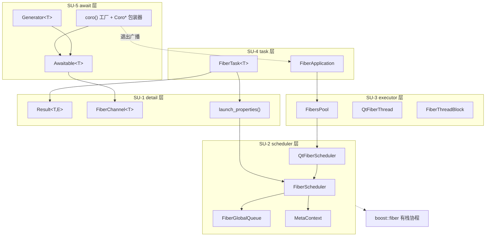

**图例说明**：本图给出五个软件单元（SU-1 至 SU-5）及其依赖方向，实线箭头读作“A 使用 B”，虚线为弱依赖。整体自上而下单向依赖、上层不被下层反向引用：

- **await 层（SU-5）**：`coro()` 工厂与 `Generator` 均围绕 `Awaitable` 构建，`Awaitable` 经基础层 `FiberChannel` 传递数据。
- **task 层（SU-4）**：`FiberTask` 用基础层 `launch_properties()` 启动协程、用 `Result` 承载结果；`FiberApplication` 管理执行器层的 `FibersPool`。
- **executor 层（SU-3）**：为每个工作线程安装调度层的 `QtFiberScheduler`。
- **scheduler 层（SU-2）**：`FiberScheduler` 使用 `FiberGlobalQueue` 与 `MetaContext` 完成“优先级 + 线程亲和”调度。
- 两条虚线：`coro ⇢ FiberApplication（退出广播）` 是唯一的“上层被动依赖”——等待器需在应用退出（`aboutToQuit`）时被关闭；`SU-2 ⇢ boost::fiber` 表示整套调度构建在 boost 有栈协程之上。
- **Qt 可选**：`QtFiberScheduler`/`QtFiberThread`/`FiberApplication`/`coro*` 在宿主工程未启用 Qt 时不编译，其余部分（`Result`/`FiberChannel`/`FiberScheduler` 基类/`FiberTask`）仍可独立使用。

### 4.3 静态结构（类图）

#### 4.3.1 调度层

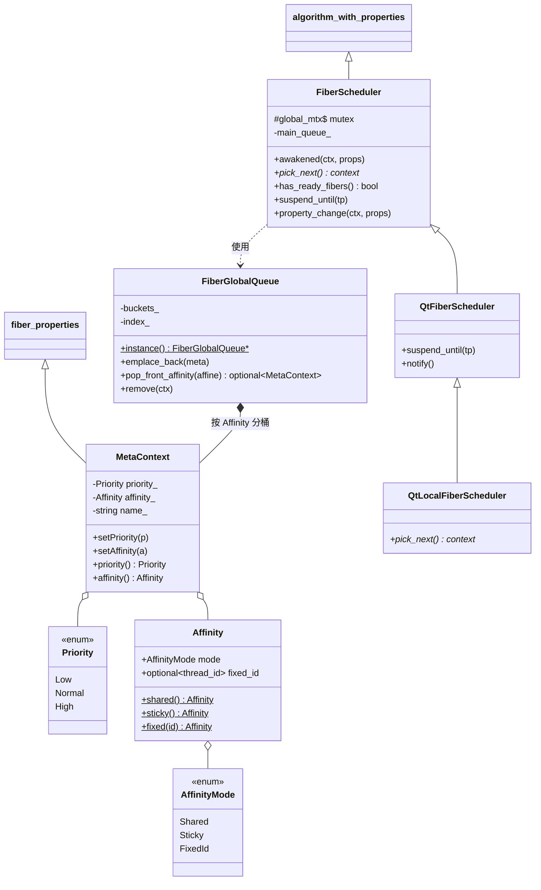

**图例说明**：本图是调度核心的静态结构。`MetaContext` 继承 boost.fiber 的 `fiber_properties`，为每个协程附带三项调度属性——`Priority`（Low/Normal/High）、`Affinity`（含 `AffinityMode` 与可选线程 id）、`name`；`setPriority/setAffinity` 修改后会通知调度器重新入队。`FiberScheduler` 实现 boost.fiber 的 `algorithm_with_properties<MetaContext>` 调度算法接口，是自定义调度的基类；继承链 `FiberScheduler ← QtFiberScheduler ← QtLocalFiberScheduler`：`QtFiberScheduler` 覆写 `suspend_until` 以在空闲时驱动 Qt 事件（用于工作线程池），`QtLocalFiberScheduler` 再覆写 `pick_next` 供宿主线程（主线程/QThread）使用。`FiberGlobalQueue` 为全局单例，`buckets_` 按 `Affinity` 分桶、桶内按 `Priority` 降序保存 `MetaContext`，`index_` 支持按上下文移除；`FiberScheduler` 通过它完成跨线程的就绪协程存取（组合关系 `FiberGlobalQueue *-- MetaContext` 表示队列按亲和聚合协程属性）。

#### 4.3.2 执行器层

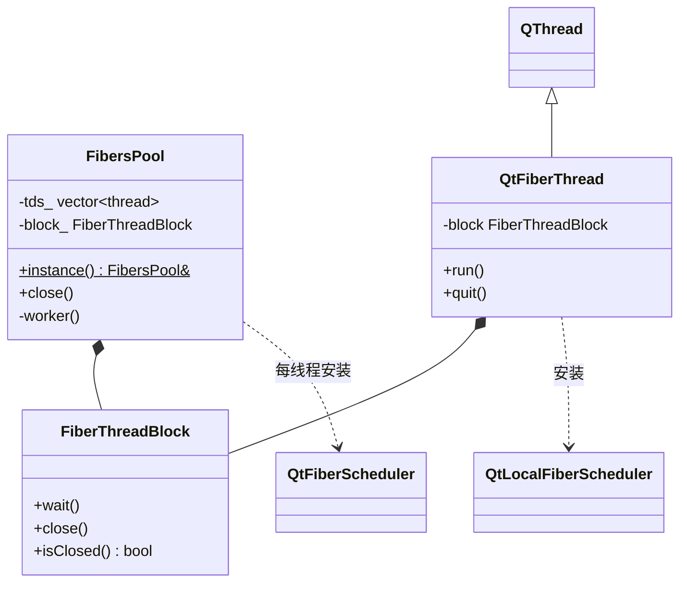

**图例说明**：本图描述“承载协程的线程”如何组织。`FiberThreadBlock` 是“阻止线程退出但允许其继续调度协程”的基元（`wait/close`）。`FibersPool` 为全局单例工作线程池，组合一个 `FiberThreadBlock`，其每个工作线程 `worker()` 安装 `QtFiberScheduler` 后 `block_.wait()` 挂起待命（线程不退出、可调度协程）。`QtFiberThread` 是继承 `QThread` 的宿主线程，同样组合 `FiberThreadBlock`，在 `run()` 中安装 `QtLocalFiberScheduler`。两者区别在于所装调度器不同：线程池用 `QtFiberScheduler`（可就地绑定 Sticky、可取 Shared，是通用工作线程）；宿主线程用 `QtLocalFiberScheduler`（只取 Fixed/Shared，适合已有事件循环归属的线程）。

#### 4.3.3 任务层

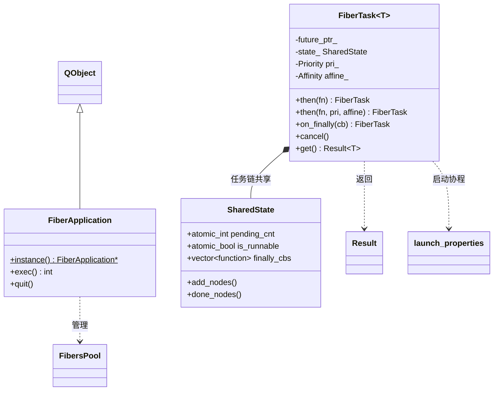

**图例说明**：本图描述结构化并发的静态结构。`FiberTask<T>` 是一次任务的句柄，持有结果 future、共享状态 `SharedState`，以及本任务的优先级与亲和；`then/on_finally/cancel/get` 构成链式编排接口。一条任务链上的所有 `FiberTask` **共享同一个 `SharedState`**（组合关系 `FiberTask *-- SharedState`），其中 `pending_cnt` 记在途节点数、`is_runnable` 为取消标志、`finally_cbs` 收集结束回调；`add_nodes/done_nodes` 维护计数并在归零时触发全部回调。`FiberTask` 通过 `launch_properties` 启动协程、以 `Result` 返回结果。`FiberApplication` 继承 `QObject`，管理 `FibersPool` 并提供 `exec/quit` 的应用生命周期入口。

#### 4.3.4 等待层与基础层

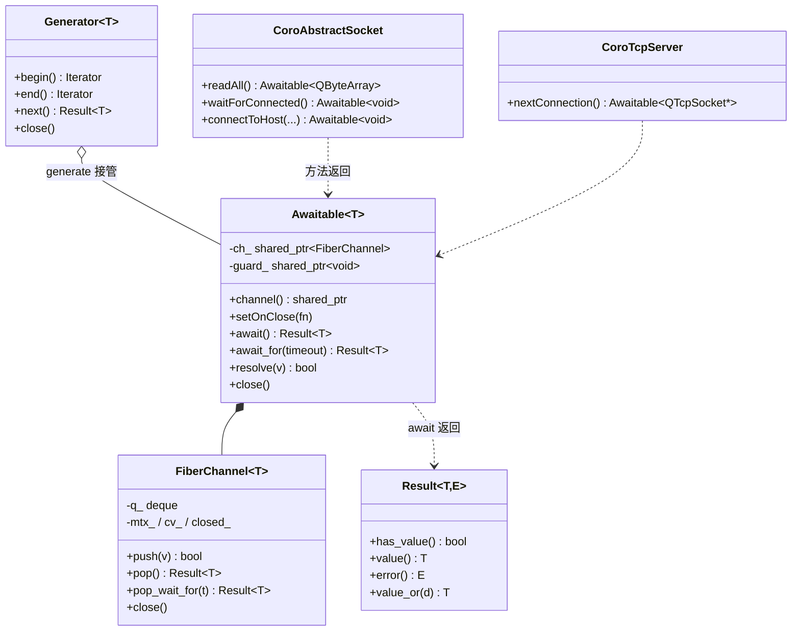

**图例说明**：本图描述“等待”与“基础”两层的静态结构与解耦设计。`Awaitable<T>` 是唯一的等待/数据载体，内部组合一个 `FiberChannel<T>`（`ch_`，实际传数据）与一个不透明生命周期守卫 `guard_`（由 `setOnClose` 注入，最后持有者析构时执行收尾）；`await/await_for` 从 channel 取值并以 `Result<T>` 返回。`FiberChannel<T>` 是基础层的跨线程安全队列（`push/pop/pop_wait_for/close`），也是 `Awaitable` 的底层载体。`Generator<T>` 通过 `generate(a)` 接管一个 `Awaitable` 实现流式迭代（聚合关系）。`CoroAbstractSocket`/`CoroTcpServer` 等 `coro()` 包装器的方法均返回 `Awaitable`。**关键设计：`Awaitable` 不含任何 Qt 类型**——Qt 依赖全部集中在 `coro*` 工厂，因此等待层本体可脱离 Qt 使用，并可扩展非 Qt 来源（对应 DD-4、R5_DESIGN）。

## 5. 执行方案

说明软件单元间的动态关系与控制流/数据流。本章以**数据流程图（§5.1）**、**时序图（§5.2）**、**状态图（§5.3）** 完整描述执行方案，并在 §5.4 说明进程/任务的动态创建与删除。静态类结构见 §4.3；图以 [Mermaid](https://mermaid.js.org/) 描述，可在 GitHub/GitLab 直接渲染。

### 5.1 数据流程图（DFD）

数据流程图刻画数据在**外部实体**、**加工（process）** 与**数据存储（data store）** 之间的流动。核心数据存储：`FiberGlobalQueue`（就绪协程集合）、`FiberChannel`（Awaitable 数据队列）、`SharedState`（任务链状态）。

#### 5.1.1 上下文图（DFD Level 0）

框架作为单一加工，外接“用户代码”“Qt 异步来源”“boost.fiber 运行时”三个外部实体。

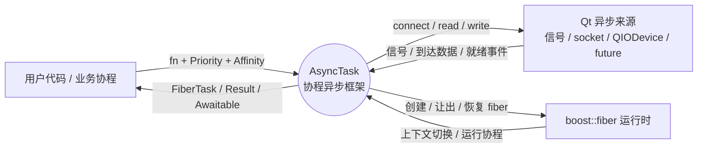

**图例说明**：上下文图（DFD Level 0）把整个框架视为单一加工，界定它与外界交换的数据、划定系统边界。三个外部实体：① **用户代码**——向框架提交可调用体与调度属性（优先级/亲和），取回 `FiberTask`/`Result`/`Awaitable`；② **Qt 异步来源**——向框架发出信号、到达数据、就绪事件，框架反向对其做 connect/read/write；③ **boost.fiber 运行时**——框架请求它创建/让出/恢复协程，它完成底层上下文切换来运行协程。要点：框架本身不产生业务数据，只在这三方之间**搬运数据与调度执行**。

#### 5.1.2 顶层数据流（DFD Level 1）

将框架分解为 5 个加工（P1–P5）与 3 个数据存储（D1–D3）。

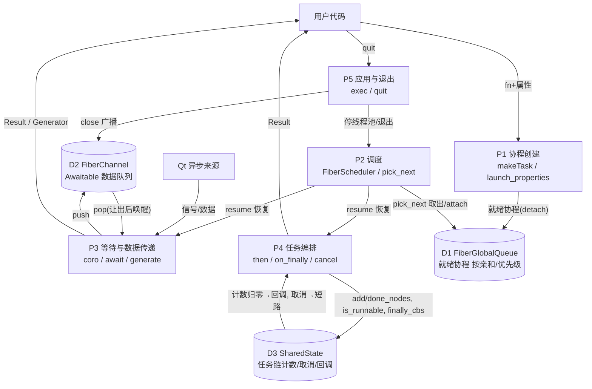

**图例说明**：本图把框架细分为 5 个加工（P1–P5）与 3 个数据存储（D1–D3），展示一条协程从创建、调度、消费到退出的完整数据走向：

- **P1 协程创建**：接收用户的可调用体与属性，把 detach 后的“就绪协程”写入 **D1 就绪协程集合**。
- **P2 调度**：从 D1 按亲和/优先级取出协程（attach）并 resume，把控制权交给运行等待的 P3 或运行任务链的 P4。
- **P3 等待与数据传递**：来源事件（信号/数据）流入并 `push` 进 **D2 数据队列**；消费侧 `pop`（无数据则让出协程），把 `Result`/`Generator` 交回用户。
- **P4 任务编排**：读写 **D3 任务链状态**（计数/取消/回调），把 `Result` 交回用户；计数归零触发结束回调，取消则令后继短路。
- **P5 应用与退出**：`quit` 时向 D2 广播 `close`、令 P2 停线程池后退出。

三个数据存储的实现与并发保护见下表：

**数据存储说明**

| 存储 | 实现 | 读者 → 写者 | 一致性保护 |
|---|---|---|---|
| D1 FiberGlobalQueue | `unordered_map<Affinity, set<MetaContext, greater>>` | P2 各线程读取/取出 ← P1、P2 写入 | 静态 `FiberScheduler::global_mtx` 串行化 |
| D2 FiberChannel | `mutex+condition_variable+deque` | P3 消费者 pop ← 来源槽 push | `boost::fibers::mutex`；跨线程/跨协程安全 |
| D3 SharedState | `atomic pending_cnt / atomic is_runnable / vector finally_cbs` | 任务链各节点读写 | 原子变量 |

#### 5.1.3 关键数据流：一次信号等待


**图例说明**：本图放大“一次信号等待”的数据路径。`obj` 发射信号时，框架在建立等待器时注入的槽被调用，它把信号参数按目数打包（无参→`void`、单参→值、多参→`tuple`），`push` 进该 `Awaitable` 的 `FiberChannel`；消费侧 `await(a)` 若此前无数据已让出协程，此刻被 `pop` 唤醒，取回 `Result<T>` 返还用户协程。要点：**生产（槽）与消费（await）经 channel 解耦**，等待期间线程不被阻塞——这正是把 Qt 回调式信号转为顺序等待的核心机制。

### 5.2 时序图

#### 5.2.1 一次信号等待（IF-2，SU-5/SU-1/SU-2）

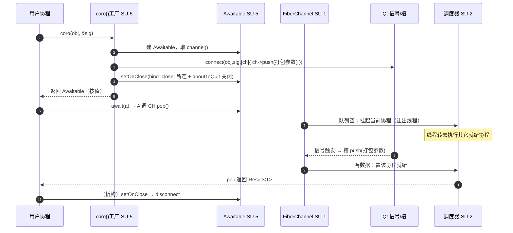

**图例说明**：本时序展示信号等待的完整生命周期（§5.1.3 的动态视角）。**建立阶段（1–5）**：用户调用 `coro(obj,&sig)`，工厂建 `Awaitable`、取其 channel，`connect` 信号到“把参数 push 进 channel”的槽，用 `setOnClose` 注入断连与关机收尾，随后按值返回 `Awaitable`。**等待阶段（6–8）**：`await(a)` 调 `pop()`，队列空时挂起当前协程、让出线程，调度器转去执行其它就绪协程。**唤醒阶段（9–11）**：信号触发使槽 push 值，协程被置为就绪并在调度后从 `pop` 返回 `Result<T>`。**收尾（12）**：`Awaitable` 析构触发 `setOnClose`，断开信号连接。要点：等待期间该线程未被阻塞，仍在为其它协程与 Qt 事件服务。

#### 5.2.2 socket 流式读（readAll + generate，IF-2）

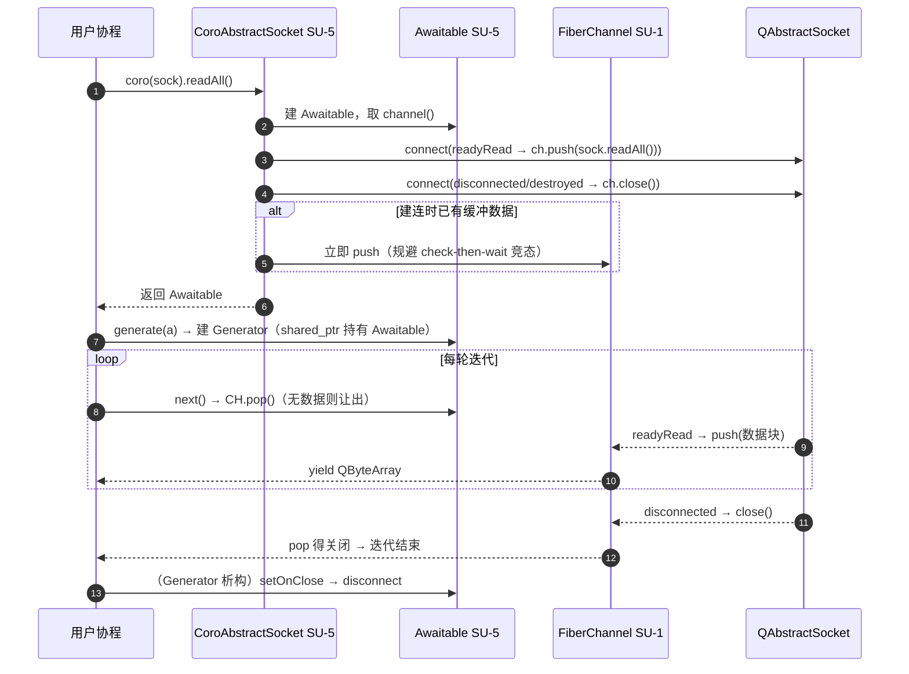

**图例说明**：本时序展示用 `generate` 对 socket 做流式读取。**建立阶段**：`coro(sock).readAll()` 建 `Awaitable`，把 `readyRead` 连接为“读取并 push 数据块”、把 `disconnected/destroyed` 连接为“关闭 channel”；若建连时套接字已有缓冲数据则**立即 push**，规避“先检查后等待”竞态导致的首包丢失。**消费阶段**：`generate(a)` 以 `shared_ptr` 持有 `Awaitable`（调度器会拷贝 fiber 函数，move-only 对象须共享持有），循环 `next()→pop()`——无数据则让出，`readyRead` 到来则产出一个 `QByteArray`。**终止阶段**：socket `disconnected` 关闭 channel，`pop` 得到关闭信号使迭代自然结束，`Generator` 析构时断开全部连接。要点：把“反复触发的 `readyRead` 回调”转为“像遍历容器一样”的顺序流式消费。

#### 5.2.3 协程跨线程调度（IF-4/IF-5，SU-2/SU-3）

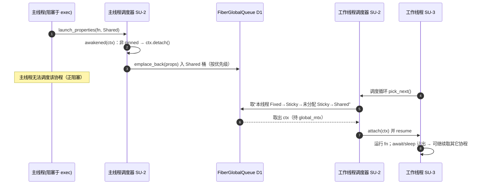

**图例说明**：本时序展示 Shared 协程如何在“创建它的线程无法运行它”时被别的线程接手。主线程在 `exec()` 处阻塞，于其上创建一个 Shared 协程：调度器 `awakened` 判定其非 pinned，`detach` 后按优先级放入全局队列的 Shared 桶。由于主线程正阻塞、无法调度它，某工作线程在 `pick_next` 循环中按“本线程 Fixed→Sticky→未分配 Sticky→Shared”的顺序（持 `global_mtx`）取出它，`attach` 到本线程并 resume。协程运行中一旦 `await/sleep` 让出，该工作线程即可继续取用其它协程。要点：**全局队列 + detach/attach** 实现跨线程工作分发，使协程不被“卡住的线程”拖住（这也是主线程阻塞于 `exec` 时后台协程仍能推进的原因）。

#### 5.2.4 任务链 then / on_finally / cancel（IF-1，SU-4）

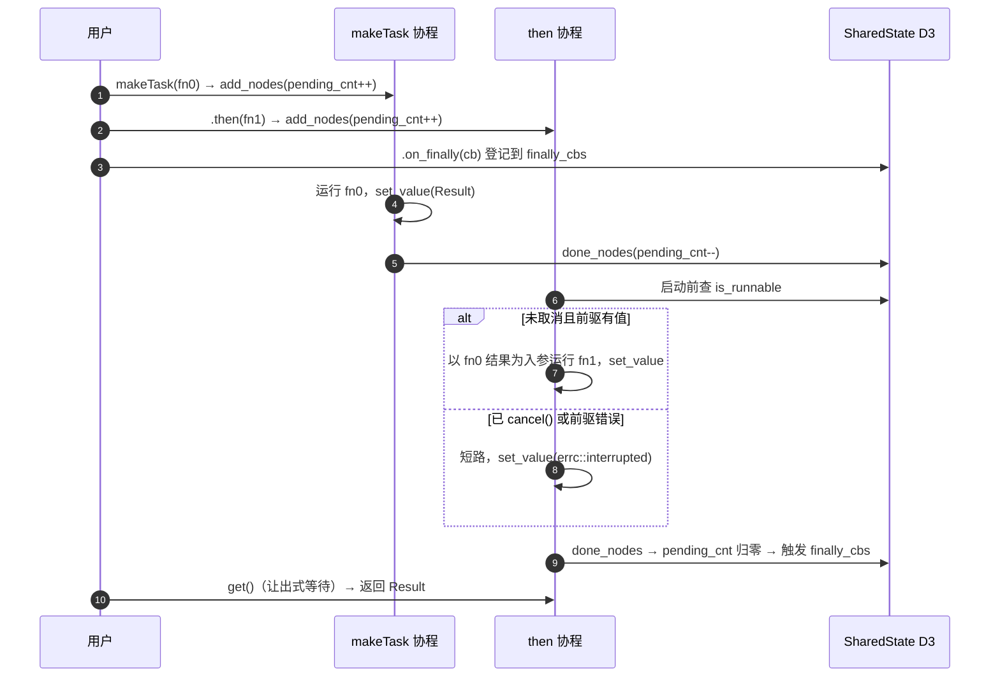

**图例说明**：本时序展示 `makeTask → then → on_finally` 与 `cancel` 的协作。建立时每个节点 `add_nodes` 使在途计数加一，`on_finally` 把回调登记到共享状态。`makeTask` 的协程运行 `fn0`、写入结果、`done_nodes`。`then` 的协程在启动前检查取消标志：**未取消且前驱有值**时以前驱结果为入参运行 `fn1` 并写入结果；**已 `cancel()` 或前驱出错**时短路，写入“中断”错误。每个节点结束都 `done_nodes`，当在途计数归零即触发全部结束回调。`get()` 以协程让出方式等待并取回 `Result`。要点：一条链共享同一 `SharedState`，实现“依赖顺序执行 + 集中收尾 + 整体取消”；取消是协作式的，只令尚未开始的节点短路。

#### 5.2.5 安全退出（IF-1，SU-4/SU-2/SU-3）

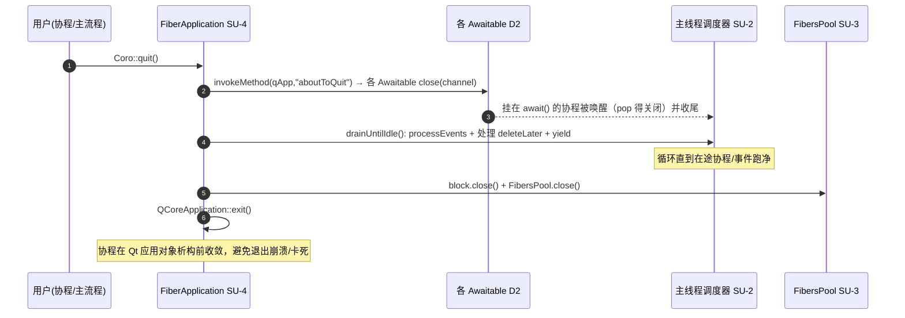

**图例说明**：本时序展示 `Coro::quit()` 的退出流程，解决“协程活过 Qt 应用对象、退出期访问已销毁事件系统导致崩溃/卡死”的问题。**① 广播**：通过 `invokeMethod` 主动触发 `aboutToQuit`（框架不用 `QCoreApplication::exec()`，需主动发此信号），各 `Awaitable` 借此关闭自己的 channel。**② 停泵**：置全局退出标志令各线程常驻泵协程自行终止（泵醒来看到标志退出，~scheduler 无残留）。**③ 唤醒收尾**：挂在 `await()` 的协程因 channel 关闭信号返回、就地收尾。**④ 排空**：`drainUntilIdle()` 循环执行 `processEvents`、派发 `deleteLater`、`yield`，直到在途协程与事件跑净。**⑤ 停机**：关闭线程阻塞与线程池，最后 `QCoreApplication::exit()`。

### 5.3 状态图

#### 5.3.1 协程调度状态（SU-2）

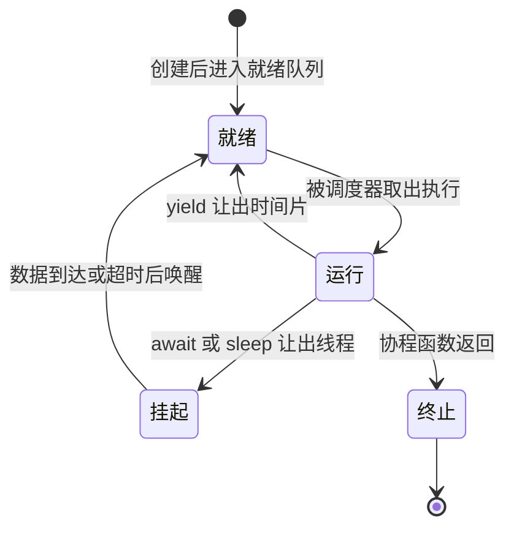

**图例说明**：本状态图刻画单个协程在调度器眼中的生命周期。创建后进入**就绪**（在全局或本地就绪集合中等待）；被调度器 `pick_next` 取出并 attach 后进入**运行**；运行中若 `await/sleep` 且条件未满足则进入**挂起**（让出线程、不占用工作线程），若 `yield` 则让出时间片后重回**就绪**；挂起态在数据到达或超时被唤醒后回到**就绪**；协程函数返回则进入**终止**、栈被回收。关键：**“挂起”不阻塞线程**——这是“少量线程承载大量协程”的基础。

#### 5.3.2 Awaitable 生命周期（SU-5）

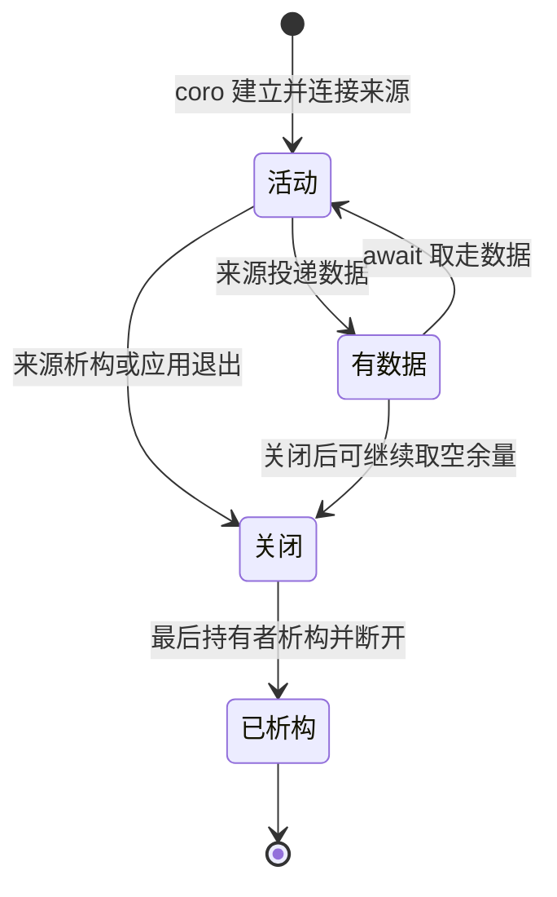

**图例说明**：本状态图刻画等待器从建立到销毁的生命周期。`coro()` 建立并连接来源后进入**活动**；来源投递数据后进入**有数据**，被 `await/pop` 取走又回到**活动**（可反复，支撑流式消费）；当来源析构或应用退出时进入**关闭**（无论此前是否有余量，余量仍可被继续取空）；当最后一个持有者析构时经 `setOnClose` 断开来源连接、进入**已析构**。要点：进入“关闭”后 `pop` 返回“无数据”错误，使正在等待/迭代的 `await`/`generate` 自然收敛；`Awaitable` 按值传递、move-only，其“最后持有者析构才断连”的语义由 `guard_` 的共享指针实现。

#### 5.3.3 FiberTask 节点状态（SU-4）

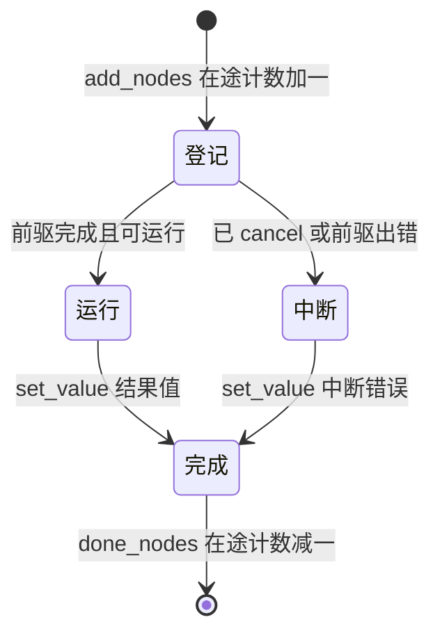

**图例说明**：本状态图刻画任务链中单个节点的状态流转。`add_nodes` 登记后进入**登记**（在途计数加一）；当前驱完成且任务链未被取消时进入**运行**，否则（已 `cancel` 或前驱出错）进入**中断**；运行成功写入结果值、中断写入“中断”错误，二者都汇入**完成**；`done_nodes` 使在途计数减一，归零时触发全部 `finally_cbs`。要点：取消是**协作式**的——只令尚未开始的节点短路，不打断正在运行的协程；`finally_cbs` 由整条链的最后一个节点触发，实现集中收尾。

### 5.4 进程/任务的动态创建与删除

- **工作线程**：`FibersPool`（SU-3）首次使用时创建 N=`max(硬件并发,2)` 个工作线程，各安装 `QtFiberScheduler` 并 `block.wait()` 挂起（线程不退出但可调度协程）；`FibersPool::close()` 唤醒使线程退出。
- **协程（fiber）**：`launch_properties`/`makeTask`（SU-1/SU-4）动态创建 fiber，`awakened` 中 `detach` 交由调度器（D1）管理；协程函数返回即终止、栈回收。
- **Awaitable/channel**：`coro()`（SU-5）按值返回 `Awaitable`，其生命周期见 §5.3.2；来源析构或 `aboutToQuit` 时关闭 channel，最后持有者析构时经 `setOnClose` 断连。
- **退出**：`Coro::quit()`（SU-4）时序见 §5.2.5——广播 `aboutToQuit`→`signalExit()` 停泵→`drainUntilIdle` 排空→关线程池→`exit()`。

## 6. 接口设计

### 6.1 接口标签和接口图
```
[用户代码]
   │ makeTask/then/get/cancel        (IF-1 任务与应用接口, SU-4/SU-1)
   │ coro/await/generate             (IF-2 等待接口, SU-5)
   │ Result/Awaitable/Generator/sleep(IF-3 基础接口, SU-1/SU-5)
   ▼
[AsyncTask]  ── IF-4 调度算法内部接口(SU-2↔boost.fiber) ── [boost::fiber]
             ── IF-5 全局队列内部接口(SU-2↔SU-2)
```

### 6.2 IF-1 任务与应用接口设计
- 优先级：高（核心对外 API）。
- 接口类型：C++ 函数/成员函数调用（头文件 `task/fibertask.h`、`task/fiberapplication.h`）。
- 数据元素：`fn`(可调用体)、`Priority`、`Affinity`、`Result<T>`。
- 通信方式：同步函数调用；`get()` 为协程内让出式阻塞。
- 接口协议：`makeTask(fn,pri,affine)→FiberTask`；`then/on_finally/cancel/get`；应用 `installFiberApplication/exec/quit`。

### 6.3 IF-2 等待接口设计
- 优先级：高。
- 接口类型：C++ 函数调用（头文件 `await/coro.hpp` 伞头或按需子头）。
- 数据元素：Qt 信号指针/Qt IO 对象/future；输出 `Awaitable<T>`/包装器/`Generator<T>`/`Result<T>`。
- 通信方式：工厂建立来源到 `FiberChannel` 的连接；`await` 为让出式阻塞，`generate` 为迭代。
- 接口协议：`coro(...)` 归一 → `await(a)`/`await_for(a,timeout)`/`generate(a)`；无参信号→`void`，多参→`tuple`；超时→`timed_out`，关闭→`no_message`。

### 6.4 IF-3 基础接口设计
- 优先级：中。
- 接口类型：C++ 类型/函数（`detail/result.hpp`、`await/awaitable.hpp`、`await/generator.hpp`、`detail/asyncdefine.h`）。
- 数据元素：`Result<T,E>`、`Awaitable<T>`、`Generator<T>`、时长。
- 通信方式：值语义/共享 channel。
- 接口协议：`Result::{has_value,value,error,value_or}`；`Awaitable::{channel,setOnClose,await,await_for,resolve,close}`；`sleep/msleep`。

### 6.5 IF-4 调度算法内部接口设计
- 优先级：高（框架正确性核心）。
- 接口类型：实现 boost.fiber `algorithm_with_properties<MetaContext>` 虚接口。
- 数据元素：`context*`、`MetaContext&`。
- 通信方式：boost.fiber 回调；`awakened/pick_next/suspend_until/notify/property_change`。
- 接口协议：须遵守 boost.fiber 对返回可运行上下文、`detach/attach`、pinned 上下文处理的约定。

### 6.6 IF-5 全局队列内部接口设计
- 优先级：高。
- 接口类型：`FiberGlobalQueue` 成员函数。
- 数据元素：`MetaContext`、`Affinity`。
- 通信方式：调用方须持有 `FiberScheduler::global_mtx`。
- 接口协议：`emplace_back/pop_front_affinity/getQueueSize/remove_*`。

## 7. 详细设计

本章给出各软件单元的内部设计（数据结构、关键算法、约束），细度以“可据此直接编码”为准；静态类结构见 §4.3，动态行为见 §5。

### 7.1 SU-1 基础层

#### 7.1.1 Result<T, E=std::error_code>
- 数据结构：以“是否有值”标志加一个存放值或错误的联合（二者互斥）。字段（设计）：`bool has_value_`；`union { T value_; E error_; }`。`void` 特化不含 `value_`，仅记成功/错误。
- 方法：`has_value()`/`operator bool()`；`value()`（仅成功时有效）；`error()`；`value_or(default)`。
- 构造：由值构造→成功；由错误码构造→失败。
- 类型萃取：`result_inner_type<R>`（取内层 T）、`flatten_result_type<R>`（`Result<Result<T>>`→`Result<T>`），用于协程返回值与等待结果的统一组合。
- 约束：不持有异常对象，一切失败以错误码表达（对应 R4、R4_IN_DATA）。

#### 7.1.2 FiberChannel<T>
设计目标：替代 boost 原生 `unbuffered_channel`（其在非协程线程 pop 会崩溃），提供跨线程/跨协程安全、可关闭的队列。
- 字段：`boost::fibers::mutex mtx_`；`boost::fibers::condition_variable cv_`；`std::deque<T> q_`；`bool closed_`。
- `push(v)`：加锁；已关闭则拒绝；否则入队并 `cv_.notify_one()`。
- `pop() -> Result<T>`：加锁，`cv_.wait` 直到队非空或已关闭；关闭且空→返回“无数据”错误；否则取队首。
- `pop_wait_for(timeout) -> Result<T>`：带超时版本，超时→返回“超时”错误。
- `close()`：置 `closed_` 并 `cv_.notify_all()`，唤醒全部等待者收敛。
- 说明：使用 fiber 版 mutex/cv，等待时**让出协程而非阻塞线程**（对应 R1_IN_DATA）。

#### 7.1.3 launch_properties / sleep / msleep
- `launch_properties(fn, pri, affine, name)`：以 `MetaContext(pri,affine,name)` 为 fiber 属性创建 `boost::fibers::fiber` 执行 `fn` 并 `detach` 交调度器管理；是“带调度属性启动协程”的统一低层入口。
- `sleep(s)` / `msleep(ms)`：包装 `boost::this_fiber::sleep_for`，休眠期让出线程。

### 7.2 SU-2 调度层（IF-4/IF-5）

#### 7.2.1 调度属性 MetaContext / Priority / Affinity
- `Priority`：枚举 `Low/Normal/High`。
- `Affinity`：`{ AffinityMode mode; optional<thread_id> fixed_id; }`，模式 `Shared/Sticky/FixedId`，工厂 `shared()/sticky()/fixed(id)`；作为分桶键须可哈希、可相等比较。
- `MetaContext : boost::fibers::fiber_properties`：持 `priority_/affinity_/name_`；`setPriority/setAffinity` 修改后 `notify()` 触发调度器 `property_change`；定义按优先级的比较（供就绪集合降序排序）。

#### 7.2.2 就绪协程集合 FiberGlobalQueue（IF-5，R2_IN_DATA）
- 结构：`unordered_map<Affinity, set<MetaContext, greater<>>> buckets_`（按亲和分桶、桶内按优先级降序）；`unordered_map<context*, MetaContext> index_`（按上下文检索，用于移除）。
- 方法：`emplace_back(meta)` 入对应桶；`pop_front_affinity(affine)` 从匹配桶取优先级最高者；`remove(ctx)`；`getQueueSize()`；单例 `instance()`。
- 并发：所有访问在持有 `FiberScheduler::global_mtx`（静态）时进行，串行化跨线程访问。

#### 7.2.3 FiberScheduler（核心调度算法）
继承 `boost::fibers::algo::algorithm_with_properties<MetaContext>`。
- 本地结构：`main_queue_`（本线程 pinned 上下文就绪队列）；用于 `suspend_until` 的等待原语。
- `awakened(ctx, props)`：
  1. `ctx` 为 pinned（本线程主/调度上下文）→ 入 `main_queue_`；
  2. 否则 `ctx->detach()`，持锁 `FiberGlobalQueue::emplace_back(props)`。
- `pick_next() -> context*`：持锁按序尝试 ① 本线程 Fixed → ② 本线程 Sticky → ③ 未分配 Sticky（就地绑定到本线程）→ ④ Shared；命中则 `ctx->attach()` 到本线程返回；否则取 `main_queue_`；皆空返回 `nullptr`。
- `has_ready_fibers()`：`main_queue_` 非空，或全局队列存在可被本线程取用者。
- `suspend_until(tp)` / `notify()`：无就绪时挂起线程至时间点或被唤醒。
- `property_change(ctx, props)`：属性变更后重新入队（受 R1_OTHER 限制：**运行期迁移线程不受支持**）。
- 约束：严格遵守 boost.fiber 对 `detach/attach`、返回可运行上下文、pinned 上下文不得 detach 的约定。

#### 7.2.4 QtFiberScheduler / QtLocalFiberScheduler
- `QtFiberScheduler : FiberScheduler`：覆写 `suspend_until`——首次调用时用 `std::call_once` 创建一个绑定当前线程的常驻泵协程（`Priority::High, Affinity::fixed(this_thread)`，detach），在 worker 协程上下文里循环 `QEventLoop::processEvents(AllEvents) + Coro::msleep(interval)` 分发 Qt 事件；`suspend_until` 自身委托基类做真正的 cv 阻塞（不再依赖 maxtime 版 `processEvents`）。泵协程受全局 `static std::atomic_bool s_exit_` 控制退出：`Coro::quit()` 调用 `signalExit()` 置位后，各线程泵醒来即退出，从而 `~scheduler` 不会因等待无限协程而挂死。
- `QtLocalFiberScheduler : QtFiberScheduler`：覆写 `pick_next` 只取 Fixed 与 Shared（不把新 Sticky 就地绑定到宿主线程），用于 Qt 主线程 / QThread 等宿主线程。

### 7.3 SU-3 执行器层

#### 7.3.1 FiberThreadBlock（R3_IN_INTERFACE）
“阻止线程退出但允许其调度协程”的基元。
- 字段：fiber `mutex`+`condition_variable`；`bool closed_`。
- `wait()`：在协程内等待直至 `closed_`（等待期间该线程仍在其调度器中调度其它协程）。
- `close()`：置 `closed_` 并 `notify_all()`。

#### 7.3.2 FibersPool（工作线程池，单例）
- 字段：`vector<thread> tds_`；`FiberThreadBlock block_`。
- `instance()`：首次调用创建 N=`max(硬件并发,2)` 个工作线程，每线程 `worker()`：安装 `QtFiberScheduler` → `block_.wait()`（线程不退出、可调度协程）。
- `close()`：`block_.close()` 唤醒各线程使其退出。

#### 7.3.3 QtFiberThread
- `QThread` 子类；`run()`：安装 `QtLocalFiberScheduler` 并 `block.wait()`，成为可承载 Fixed 协程的宿主线程；`quit()`：`block.close()`。

### 7.4 SU-4 任务层（IF-1）

#### 7.4.1 SharedState（任务链共享状态，R3_IN_DATA）
- 字段：`atomic<int> pending_cnt`（在途节点数）；`atomic<bool> is_runnable`（取消标志，初值 true）；`vector<function<void()>> finally_cbs`。
- `add_nodes()`：`pending_cnt++`（登记一个节点）。
- `done_nodes()`：`--pending_cnt`；归零时依次执行 `finally_cbs`。

#### 7.4.2 FiberTask<T>
- 字段：`shared_ptr<promise/future<Result<T>>>`；`shared_ptr<SharedState> state_`；`Priority pri_`；`Affinity affine_`。
- `makeTask(fn,pri,affine)`：建 `SharedState`→`add_nodes`；`launch_properties` 启动协程：运行 `fn`（异常在边界转错误码）→ `set_value(Result)` → `done_nodes`；返回 `FiberTask`。
- `then(fn[,pri,affine])`：`add_nodes`；启动后继协程：等前驱 future 就绪；若 `!is_runnable` 或前驱为错误 → `set_value(interrupted)`；否则以前驱结果为入参运行 `fn` → `set_value`；末尾 `done_nodes`。后继默认继承 `pri_/affine_`。
- `on_finally(cb)`：`finally_cbs.push_back(cb)`。
- `cancel()`：`is_runnable = false`。
- `get()`：等待 future（协程内让出）并返回 `Result<T>`。

#### 7.4.3 FiberApplication
- `installFiberApplication()`：主线程安装 `QtLocalFiberScheduler`，启动 `FibersPool`。
- `exec()`：主线程 `block.wait()`（留在协程调度器中，协程与 Qt 事件都能推进）。
- `quit()`：① `QMetaObject::invokeMethod(qApp,"aboutToQuit",DirectConnection)` 广播关机（各 Awaitable 借此关闭 channel）；② `QtFiberScheduler::signalExit()` 置全局退出标志，令各线程常驻泵协程自行终止；③ `drainUntilIdle()`：循环 `processEvents` + 派发 `DeferredDelete` + `this_fiber::yield`，直至就绪集合空闲；④ `block.close()` + `FibersPool::close()`；⑤ `QCoreApplication::exit()`。

### 7.5 SU-5 等待层（IF-2/IF-3）

#### 7.5.1 Awaitable<T>
- 字段：`shared_ptr<FiberChannel<T>> ch_`；`shared_ptr<void> guard_`（不透明生命周期守卫）。`void` 特化用 `FiberChannel<int>` 承载“发生一次”信号。
- `channel()`：返回 `ch_`（生产者只捕获它、不持有整个 Awaitable，避免引用环）。
- `setOnClose(fn)`：`guard_ = shared_ptr<void>(nullptr, [fn](void*){ if(fn) fn(); })`——最后一个持有者析构时执行 `fn`（如断开信号连接），实现 RAII 收尾且本体不含 Qt 类型。
- `await()`=`ch_->pop()`；`await_for(t)`=`ch_->pop_wait_for(t)`；`resolve(v)`=`ch_->push(v)`；`close()`=`ch_->close()`。move-only、按值传递、跨线程安全。

#### 7.5.2 Generator<T> 与 generate(a)
- `Generator<T>`：基于协程的产出序列，提供 `begin()/end()`（输入迭代器）、`next()`、`close()`。
- `generate(Awaitable<T> a)`：以 `shared_ptr<Awaitable>` 持有 `a`（调度器会拷贝 fiber 函数，move-only 对象须共享持有），循环 `a.await()`：有值 `yield`，得关闭/错误则结束迭代。

#### 7.5.3 coro() 工厂族与公共设施
统一套路：建 `Awaitable` → 连接来源把数据 push 进 `channel()` → `setOnClose(bind_close(...))` 注入断连与关机收尾 → 按值返回。按来源分文件：
- `corosignal.hpp`：`coro(obj,&sig)` / `coro<Types...>(obj,&sig)`——用 `detail/signalpack` 把信号参数打包为 void / 值 / tuple。
- `corofuture.hpp`：`coro(std::future/QFuture)`。
- `coroiodevice/corosocket/corotcpserver/corolocalsocket.hpp`：`coro(QIODevice*/QAbstractSocket*/QTcpServer*/QLocalSocket*)` 返回包装器，方法名镜像原 Qt API（`readAll`/`waitForConnected`/`connectToHost`/`nextConnection` 等）；`readAll` 建连时若已有缓冲数据立即 push（规避 check-then-wait 竞态）。
- `detail/lifecycle.hpp` 的 `bind_close(sender, ch, conns)`：连接 sender `destroyed` → `ch->close()`、qApp `aboutToQuit` → `ch->close()`，返回“断开全部连接”的闭包供 `setOnClose`。
- 约束：`Awaitable` 不含 Qt 类型；全部 Qt 依赖集中在本工厂族头文件（对应 R5_DESIGN）。

## 8. 需求可追踪性

每个 SRS 需求分配到对应软件单元/接口（→ 表示“由…实现”）。

| SRS 需求 | 分配的软件单元 / 接口 |
|---|---|
| R1_BASIC_ABILITY 协程创建与执行 | SU-4(makeTask/FiberTask)、SU-1(launch_properties) / IF-1 / §5.2.1,§5.3.1 |
| R1_MOT_1..3 让出/顺序化/少线程 | DD-1(有栈协程,阻塞式让出)、DD-2(调度) / §3 |
| R2_BASIC_ABILITY 优先级与线程亲和调度 | SU-2(FiberScheduler/FiberGlobalQueue)、SU-3(FibersPool) / IF-4,IF-5 / §5.2.3 |
| R3_BASIC_ABILITY 结构化并发 | SU-4(FiberTask/SharedState) / IF-1 / §5.2.4,§5.3.3 |
| R4_BASIC_ABILITY 结果与错误传递 | SU-1(Result) / IF-3 |
| R5_BASIC_ABILITY 统一协程等待 | SU-5(Awaitable/Generator/coro) / IF-2,IF-3 / §5.2.1,§5.2.2,§5.3.2 |
| R5_MOT_1..3 回调转顺序/不阻塞事件循环/流式 | DD-3(coro 工厂归一)、DD-4(Awaitable 解耦) / §5.1.3 |
| R6_BASIC_ABILITY Qt 集成与安全退出 | SU-2(QtFiberScheduler)、SU-3(QtFiberThread)、SU-4(FiberApplication) / IF-1,IF-4 / §5.2.5,§7.2.4 |
| R1_INTERFACE 任务与应用接口 | SU-4/SU-1 / IF-1 |
| R2_INTERFACE 等待接口 | SU-5 / IF-2 |
| R3_INTERFACE 基础接口 | SU-1/SU-5 / IF-3 |
| R1_IN_INTERFACE 调度算法接口 | SU-2 / IF-4 / §7.2.3 |
| R2_IN_INTERFACE 全局队列接口 | SU-2 / IF-5 / §7.2.2 |
| R3_IN_INTERFACE 线程阻塞接口 | SU-3 / §7.3.1 |
| R1_IN_DATA 队列数据 FiberChannel | SU-1 / §7.1.2 |
| R2_IN_DATA 全局队列数据 | SU-2 / §7.2.2 |
| R3_IN_DATA 任务共享状态 SharedState | SU-4 / §7.4.1 |
| R4_IN_DATA 协程属性 MetaContext | SU-2 / §7.2.1 |
| R1..R7_DESIGN 设计与实现约束 | 全体单元 / §3 设计决策、§4 结构 |
| R1_OTHER 运行时改亲和限制 | SU-2 / §7.2.3 约束 |
| R2_OTHER 调度期 deleteLater 限制 | SU-2/SU-4 / DD-6、§7.4.3 |
| R3_OTHER 交付物(boost) | 构建约束 / §3 依赖、DD-6 |
| R4_OTHER 测试 | test/ 套件 |
